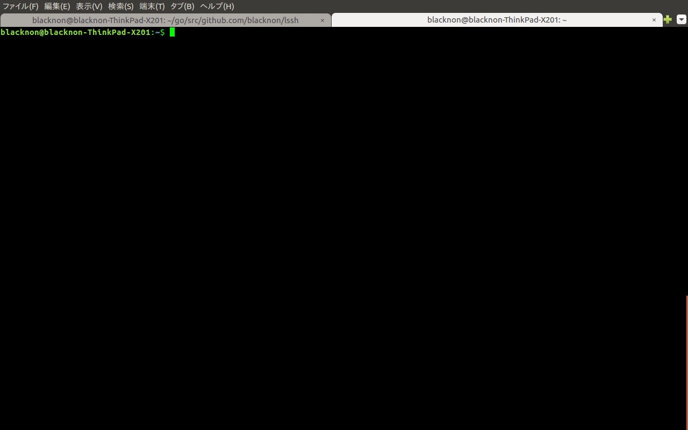
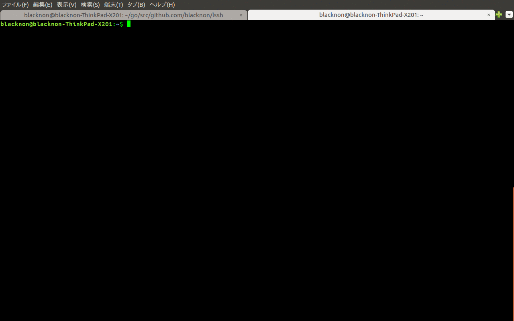

lssh
====

List selection formula ssh wrapper command

## Description

lssh is List selection formula ssh wrapper command

## Demo

## Requirement

need the following command.

- ssh
- script (log enable only)
- awk (log enable only)

## Install

    go get github.com/blacknon/lssh
    go install github.com/blacknon/lssh
    cp $GOPATH/src/github.com/blacknon/lssh/example/config.tml ~/.lssh.conf
    chmod 600 ~/.lssh.conf

## Usage

Please edit "~/.lssh.conf".
config ex)

	[log]
	enable = true
	dirpath = "/path/to/logdir"

	[server.PasswordAuth_ServerName]
	addr = "192.168.100.101"
	port = "22"
	user = "test"
	pass = "Password"
	note = "Password Auth Server"

	[server.KeyAuth_ServerName]
	addr = "192.168.100.102"
	port = "22"
	user = "test"
	key  = "/path/to/private_key"
	note = "Key Auth Server"

After exec command.

    lssh

option

	lssh v0.3
	usage: lssh [--host HOST] [--list] [--file FILE] [--terminal] [--command COMMAND]

	options:
	  --host HOST, -H HOST   Connect servername
	  --list, -l             print server list
	  --file FILE, -f FILE   config file path [default: /home/blacknon/.lssh.conf]
	  --terminal, -T         Run specified command at terminal
	  --command COMMAND, -C COMMAND
	                         Remote Server exec command.
	  --help, -h             display this help and exit
	  --version              display version and exit

multi select node Ctrl+X.

### copy files using stdin/stdout to/from remote server

You can scp like copy files using stdin/stdout.

	# from local to remote server
	cat LOCAL_PATH | lssh -e 'cat > REMOTE_PATH'

	# from remote server to local
	lssh -e 'cat REMOTE_PATH' | cat > LOCAL_PATH

### Use list select type ssh gateway server

#### '/etc/passwd' use

To use as a ssh gateway server as list select type, specify it at an execution command in "/etc/passwd"( or "authorized_keys").

ex) /etc/passwd

    lssh:x:1000:1000::/home/lssh:/bin/lssh

Arrange "~/.lssh.conf" and connect with ssh.

#### '/etc/passwd' with 'tmux' use

ex) /etc/passwd

    lssh:x:1000:1000::/home/lssh:/usr/bin/tmux

add this line at lssh exec user's '.tmux.conf'.
ex) ~/.tmux.conf

    set-option -g default-command /usr/local/bin/lssh

## Licence

A short snippet describing the license [MIT](https://github.com/blacknon/lssh/blob/master/LICENSE.md).

## Author

[blacknon](https://github.com/blacknon)
