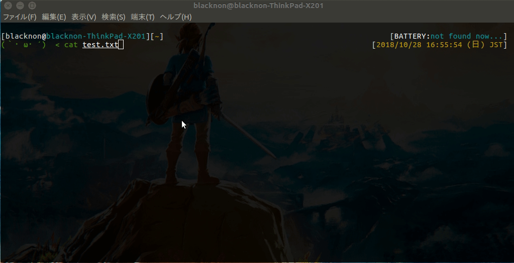
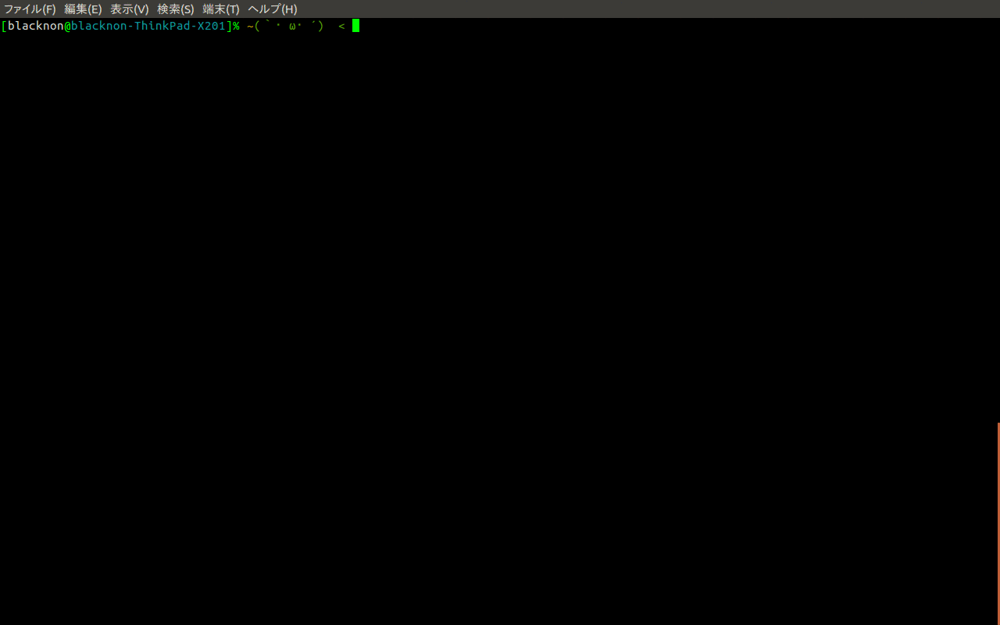
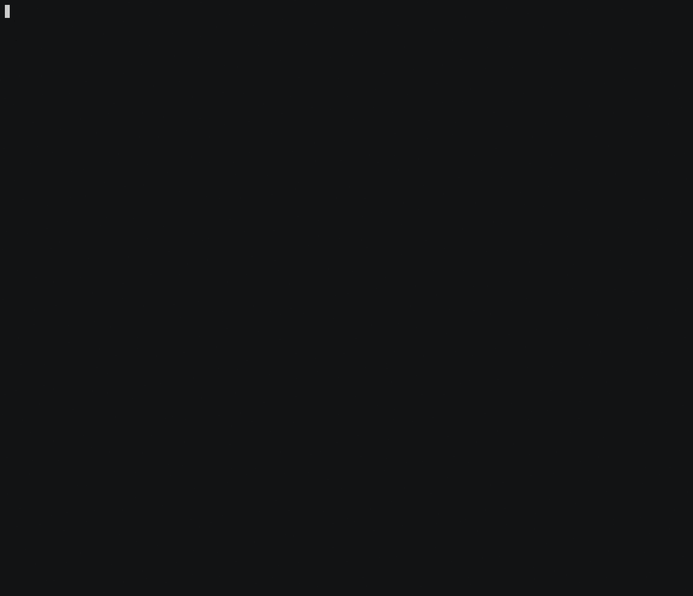

lssh
====

TUI list select ssh/scp client.

## Description

command to read a prepared list in advance and connect ssh/scp the selected host. List file is set in yaml format.When selecting a host, you can filter by keywords. Can execute commands concurrently to multiple hosts.

## Demo

## Requirement

lscp is need the following command in remote server.

- scp

## Install

compile gofile(tested go1.8.3).

    go get github.com/blacknon/lssh
    cd $GOPATH/src/github.com/blacknon/lssh
    make && sudo make install && make clean

brew install(Mac OS X)

	brew tap blacknon/lssh
	brew install lssh

	# generate .lssh.conf(not use ~/.ssh/config)
	curl -s https://raw.githubusercontent.com/blacknon/lssh/master/example/config.tml | cp -n <(cat) ~/.lssh.conf # copy sample config file

	# generate .lssh.conf(use ~/.ssh/config.not support proxy)
	lssh --generate > ~/.lssh.conf

## Usage

Please edit "~/.lssh.conf". The connection information at servers,can be divided into external files. log dir "\<Date\>" => date(YYYYMMDD) ,"\<Hostname\>" => Servername.

example:

	# terminal log settings
	[log]
	enable = true
	dirpath = "/path/to/logdir"

	# server common settings
	[common] 
	port = "22"
	user = "test"

	# include config file settings and path
	[include.Name]
	path = "/path/to/include/file"

	[server.PasswordAuth_ServerName]
	addr = "192.168.100.101"
	pass = "Password"
	note = "Password Auth Server"

	[server.KeyAuth_ServerName]
	addr = "192.168.100.102"
	user = "test-user"
	key  = "/path/to/private_key"
	note = "Key Auth Server"

	[server.LocalCommand_ServerName]
	addr = "192.168.100.103"
	key  = "/path/to/private_key"
	note = "Before/After run local command"
	pre_cmd = "(option) exec command before ssh connect."
	post_cmd = "(option) exec command after ssh disconnected."

	[server.sshProxyServer]
	addr = "192.168.100.200"
	key  = "/path/to/private_key"
	note = "proxy server"

	[server.overProxyServer]
	addr = "192.168.10.10"
	key  = "/path/to/private_key"
	note = "connect use ssh proxy"
	proxy = "sshProxyServer"

	[server.overProxyServer2]
	addr = "192.168.10.100"
	key  = "/path/to/private_key"
	note = "connect use ssh proxy(multiple)"
	proxy = "overProxyServer"

After run command.

    lssh

option(lssh)

	lssh v0.5.0
	Usage: lssh [--host HOST] [--list] [--file FILE] [--terminal] [--parallel] [--generate] [--command COMMAND]

	Options:
	  --host HOST, -H HOST   connect servername
	  --list, -l             print server list
	  --file FILE, -f FILE   config file path
	  --terminal, -t         run specified command at terminal
	  --parallel, -p         run command parallel node(tail -F etc...)
	  --generate             (beta) generate .lssh.conf from .ssh/config.(not support ProxyCommand)
	  --command COMMAND, -c COMMAND
	                         remote Server exec command.
	  --help, -h             display this help and exit
	  --version              display version and exit

option(lscp)

	lscp v0.5.0
	Usage: lscp [--host HOST] [--file FILE] [--permission] FROM TO

	Positional arguments:
	  FROM                   copy from path (local:<path>|remote:<path>)
	  TO                     copy to path (local:<path>|remote:<path>)

	Options:
	  --host HOST, -H HOST   connect servername
	  --file FILE, -f FILE   config file path
	  --permission, -p       copy file permission
	  --help, -h             display this help and exit
	  --version              display version and exit

If you specify a command as an argument, you can select multiple hosts. Select host 'Tab', select all displayed hosts 'Ctrl + A'.

### [lssh] copy files using stdin/stdout to/from remote server

You can scp like copy files using stdin/stdout.It also supports multiple nodes(parallel is not yet supported now).

	# from local to remote server
	cat LOCAL_PATH | lssh -C 'cat > REMOTE_PATH'

	# from remote server to local
	lssh -C 'cat REMOTE_PATH' | cat > LOCAL_PATH

### [lssh] multiple node select exec tail -f

	# -p option parallel exec command
	lssh -p -c 'cmd'

### [lscp] scp remote to local (get)

exec lscp get file/dir (remote to local scp).

	lscp remote:/path/to/remote local:/path/to/local
	
	# short version
	lscp r:/path/to/remote l:/path/to/local

### [lscp] scp local to remote (put)

exec lscp put file/dir (local to remote scp). If multiple server selected, mkdir servername dir.

	lscp local:/path/to/remote remote:/path/to/local
	
	# short version
	lscp l:/path/to/local r:/path/to/remote

### [lscp] scp remote to remote

exec lscp get/put file/dir (remote to remote scp).

	lscp remote:/path/to/remote(get) remote:/path/to/remote(put)
	
	# short version
	lscp r:/path/to/remote(get) r:/path/to/local(put)

## Licence

A short snippet describing the license [MIT](https://github.com/blacknon/lssh/blob/master/LICENSE.md).

## Author

[blacknon](https://github.com/blacknon)
