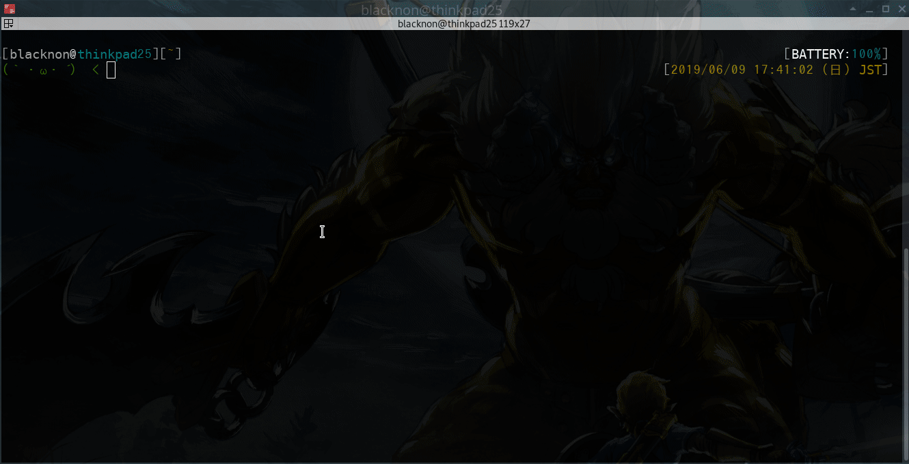
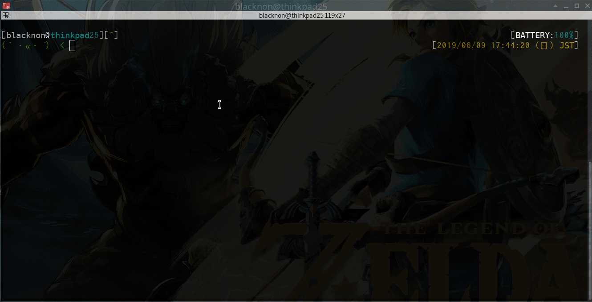
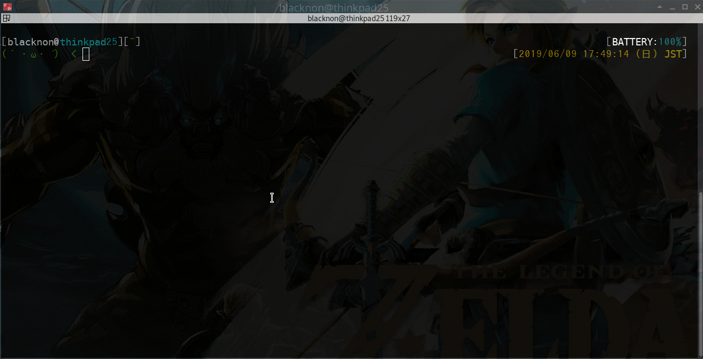
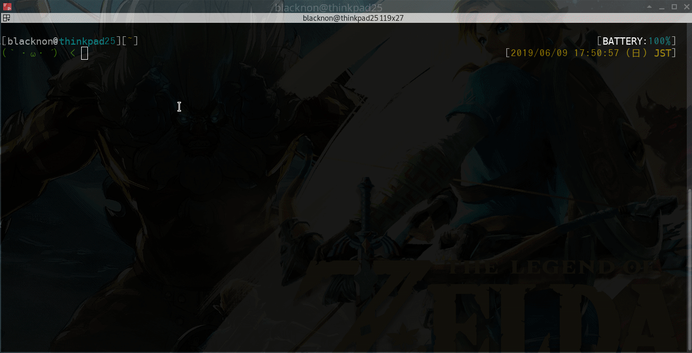

lssh
====

TUI list select ssh/scp client.

## Description

command to read a prepared list in advance and connect ssh/scp the selected host. List file is set in yaml format. When selecting a host, you can filter by keywords. Can execute commands concurrently to multiple hosts. Supported multiple ssh proxy, and supported http/socks5 proxy.

## Features

* List selection type ssh client.
* Pure Go.
* Commands can be executed by ssh connection in parallel.
* Supported ssh multiple proxy, http/socks5 proxy.
* Supported ssh-agent.
* Supported Port forward, x11 forward.
* Can use bashrc of local machine at ssh connection destination.

## Demo

## Requirement

lscp is need the following command in remote server.

- scp

## Install

compile gofile(tested go1.12.4).

    go get -u github.com/blacknon/lssh/cmd/lssh
    go get -u github.com/blacknon/lssh/cmd/lscp

    # copy sample config. create `~/.lssh.conf`.
    test -f ~/.lssh.conf||curl -s https://raw.githubusercontent.com/blacknon/lssh/master/example/config.tml -o ~/.lssh.conf

or

    git clone https://github.com/blacknon/lssh
    cd lssh
    make && sudo make install

    # copy sample config. create `~/.lssh.conf`.
    test -f ~/.lssh.conf||curl -s https://raw.githubusercontent.com/blacknon/lssh/master/example/config.tml -o ~/.lssh.conf

brew install(Mac OS X)

	brew tap blacknon/lssh
	brew install lssh

	# copy sample config. create `~/.lssh.conf`.
	test -f ~/.lssh.conf||curl -s https://raw.githubusercontent.com/blacknon/lssh/master/example/config.tml -o ~/.lssh.conf

## Config

Please edit "~/.lssh.conf".\
For details see [wiki](https://github.com/blacknon/lssh/wiki/Config).

## Usage

run command.

    lssh

option(lssh)

	NAME:
	    lssh - TUI list select and parallel ssh client command.
	USAGE:
	    lssh [options] [commands...]
	
	OPTIONS:
	    --host value, -H value      connect servernames
	    --file value, -f value      config file path (default: "/Users/uesugi/.lssh.conf")
	    --portforward-local value   port forwarding local port(ex. 127.0.0.1:8080)
	    --portforward-remote value  port forwarding remote port(ex. 127.0.0.1:80)
	    --list, -l                  print server list from config
	    --term, -t                  run specified command at terminal
	    --shell, -s                 use lssh shell (Beta)
	    --parallel, -p              run command parallel node(tail -F etc...)
	    --x11, -X                   x11 forwarding(forward to ${DISPLAY})
	    --help, -h                  print this help
	    --version, -v               print the version
	
	COPYRIGHT:
	    blacknon(blacknon@orebibou.com)
	
	VERSION:
	    0.5.6
	
	USAGE:
	    # connect ssh
	    lssh
	
	    # parallel run command in select server over ssh
	    lssh -p command...
	
	    # parallel run command in select server over ssh, do it interactively.
	    lssh -s

option(lscp)
	
	NAME:
	    lscp - TUI list select and parallel scp client command.
	USAGE:
	    lscp [options] (local|remote):from_path... (local|remote):to_path
	
	OPTIONS:
	    --host value, -H value  connect servernames
	    --list, -l              print server list from config
	    --file value, -f value  config file path (default: "/Users/uesugi/.lssh.conf")
	    --permission, -p        copy file permission
	    --help, -h              print this help
	    --version, -v           print the version
	
	COPYRIGHT:
	    blacknon(blacknon@orebibou.com)
	
	VERSION:
	    0.5.6
	
	USAGE:
	    # local to remote scp
	    lscp /path/to/local... remote:/path/to/remote
	
	    # remote to local scp
	    lscp remote:/path/to/remote... /path/to/local
	
	    # remote to remote scp
	    lscp remote:/path/to/remote... remote:/path/to/local

If you specify a command as an argument, you can select multiple hosts. Select host <kbd>Tab</kbd>, select all displayed hosts <kbd>Ctrl</kbd> + <kbd>a</kbd>.

### 1. [lssh] connect terminal

You can connect to the terminal like a normal ssh command (OpenSSH).

You can connect using a local bashrc file (if ssh login shell is bash).

`~/.lssh.conf` example.

    [server.localrc]
	addr = "192.168.100.104"
	key  = "/path/to/private_key"
	note = "Use local bashrc files."
	local_rc = 'yes'
	local_rc_file = [
         "~/dotfiles/.bashrc"
        ,"~/dotfiles/bash_prompt"
        ,"~/dotfiles/sh_alias"
        ,"~/dotfiles/sh_export"
        ,"~/dotfiles/sh_function"
	]

You can execute commands before and after ssh connection.\
You can also change the color of each host's terminal by combining it with the OSC escape sequence.

if iTerm2, you can also change the profile.

`~/.lssh.conf` example.

    [server.iTerm2_sample]
	addr = "192.168.100.103"
	key  = "/path/to/private_key"
	note = "Before/After run local command"
	pre_cmd = 'printf "\033]50;SetProfile=Theme\a"'    # ssh theme
    post_cmd = 'printf "\033]50;SetProfile=Default\a"' # local theme
	note = "(option) exec command after ssh disconnected."

    [server.GnomeTerminal_sample]
	addr = "192.168.100.103"
	key  = "/path/to/private_key"
	note = "Before/After run local command"
	pre_cmd = 'printf "\e]10;#ffffff\a\e]11;#503000\a"'  # ssh color
    post_cmd = 'printf "\e]10;#ffffff\a\e]11;#000000\a"' # local color
	note = "(option) exec command after ssh disconnected."

### 2. [lssh] run command (parallel)

It is possible to execute by specifying command in argument.\
Parallel execution can be performed by adding the `-p` option.

	# exec command over ssh.
	lssh <command...>

	# exec command over ssh, parallel.
	lssh -p <command>

In parallel connection mode (`-p` option), Stdin can be sent to each host.\

Can be piped to send Stdin.

	# You can pass values ​​in a pipe
	command... | lssh <command...>

### 3. [lssh] Execute commands interactively (lssh shell)

You can send commands to multiple servers interactively.

	# lssh shell connect
	lssh -s

### 4. [lscp] scp (local=>remote(multi), remote(multi)=>local, remote=>remote(multi))

You can do scp by selecting a list with the command lscp.\
You can select multiple connection destinations.

`local => remote(multiple)`

    # lscp local => remote(multiple)
    lscp /path/to/local... r:/path/to/remote

`remote(multiple) => local`

    # lscp remote(multiple) => local
    lscp r:/path/to/remote... /path/to/local

`remote => remote(multiple)`

    # lscp remote => remote(multiple)
    lscp r:/path/to/remote... r:/path/to/local

### 5. use ~/.ssh/config

Load and use `~/.ssh/config` by default.\
`ProxyCommand` can also be used.

Alternatively, you can specify and read the path as follows: In addition to the path, ServerConfig items can be specified and applied collectively.

	[sshconfig.default]
	path = "~/.ssh/config"
	pre_cmd = 'printf "\033]50;SetProfile=local\a"'
	post_cmd = 'printf "\033]50;SetProfile=Default\a"'

### 6. include ServerConfig file.

You can include server settings in another file.\
`common` settings can be specified for each file that you went out.

`~/.lssh.conf` example.

	[includes]
	path = [
    	 "~/.lssh.d/home.conf"
    	,"~/.lssh.d/cloud.conf"
	]

`~/.lssh.d/home.conf` example.

	[common]
	pre_cmd = 'printf "\033]50;SetProfile=dq\a"'       # iterm2 ssh theme
	post_cmd = 'printf "\033]50;SetProfile=Default\a"' # iterm2 local theme
	ssh_agent_key = ["~/.ssh/id_rsa"]
	ssh_agent = false
	user = "user"
	key = "~/.ssh/id_rsa"
	pkcs11provider = "/usr/local/lib/opensc-pkcs11.so"
	
	[server.Server1]
	addr = "172.16.200.1"
	note = "TEST Server1"
	local_rc = "yes"
	
	[server.Server2]
	addr = "172.16.200.2"
	note = "TEST Server2"
	local_rc = "yes"

The priority of setting values ​​is as follows.

`[server.hogehoge]` > `[common] at Include file` > `[common] at ~/.lssh.conf`

### 7. Supported Proxy

Supports multiple proxy.

* http
* socks5
* ssh

Besides this, you can also specify ProxyCommand like OpenSSH.

`http` proxy example.

	[proxy.HttpProxy]
	addr = "example.com"
	port = "8080"

	[server.overHttpProxy]
	addr = "over-http-proxy.com"
	key  = "/path/to/private_key"
	note = "connect use http proxy"
	proxy = "HttpProxy"
	proxy_type = "http"

`socks5` proxy example.

	[proxy.Socks5Proxy]
	addr = "example.com"
	port = "54321"

	[server.overSocks5Proxy]
	addr = "192.168.10.101"
	key  = "/path/to/private_key"
	note = "connect use socks5 proxy"
	proxy = "Socks5Proxy"
	proxy_type = "socks5"

`ssh` proxy example.

	[server.sshProxyServer]
	addr = "192.168.100.200"
	key  = "/path/to/private_key"
	note = "proxy server"
	
	[server.overProxyServer]
	addr = "192.168.10.10"
	key  = "/path/to/private_key"
	note = "connect use ssh proxy"
	proxy = "sshProxyServer"
	
	[server.overProxyServer2]
	addr = "192.168.10.100"
	key  = "/path/to/private_key"
	note = "connect use ssh proxy(multiple)"
	proxy = "overProxyServer"

`ProxyCommand` proxy example.

	[server.ProxyCommand]
	addr = "192.168.10.20"
	key  = "/path/to/private_key"
	note = "connect use ssh proxy(multiple)"
	proxy_cmd = "ssh -W %h:%p proxy"

### 8. Available authentication method

* Password auth
* Publickey auth
* Certificate auth
* PKCS11 auth
* Ssh-Agent auth

`password` auth example.

	[server.PasswordAuth]
	addr = "password_auth.local"
	user = "user"
	pass = "Password"
	note = "password auth server"

`publickey` auth example.

	[server.PublicKeyAuth]
	addr = "pubkey_auth.local"
	user = "user"
	key = "~/path/to/key"
	note = "Public key auth server"

	[server.PublicKeyAuth_with_passwd]
	addr = "password_auth.local"
	user = "user"
	key = "~/path/to/key"
	keypass = "passphase"
	note = "Public key auth server with passphase"

`cert` auth example.\
(pkcs11 key is not supported in the current version.)

	[server.CertAuth]
	addr = "cert_auth.local"
	user = "user"
	cert = "~/path/to/cert"
	certkey = "~/path/to/certkey"
	note = "Certificate auth server"

	[server.CertAuth_with_passwd]
	addr = "cert_auth.local"
	user = "user"
	cert = "~/path/to/cert"
	certkey = "~/path/to/certkey"
	certkeypass = "passphase"
	note = "Certificate auth server with passphase"

`pkcs11` auth example.

	[server.PKCS11Auth]
	addr = "pkcs11_auth.local"
	user = "user"
	pkcs11provider = "/usr/local/lib/opensc-pkcs11.so"
	pkcs11 = true
	note = "PKCS11 auth server"

	[server.PKCS11Auth_with_PIN]
	addr = "pkcs11_auth.local"
	user = "user"
	pkcs11provider = "/usr/local/lib/opensc-pkcs11.so"
	pkcs11 = true
	pkcs11pin = "123456"
	note = "PKCS11 auth server"

`ssh-agent` auth example.

	[server.SshAgentAuth]
	addr = "agent_auth.local"
	user = "user"
	agentauth = true # auth ssh-agent
	note = "ssh-agent auth server"

## Licence

A short snippet describing the license [MIT](https://github.com/blacknon/lssh/blob/master/LICENSE.md).

## Author

[blacknon](https://github.com/blacknon)
