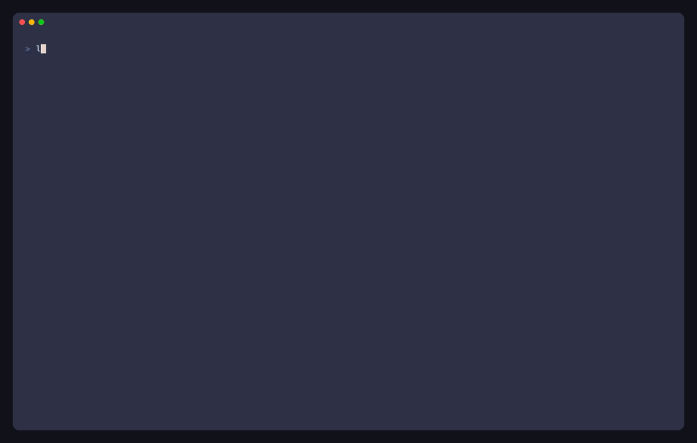
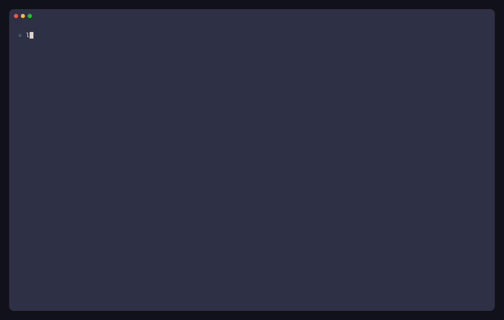
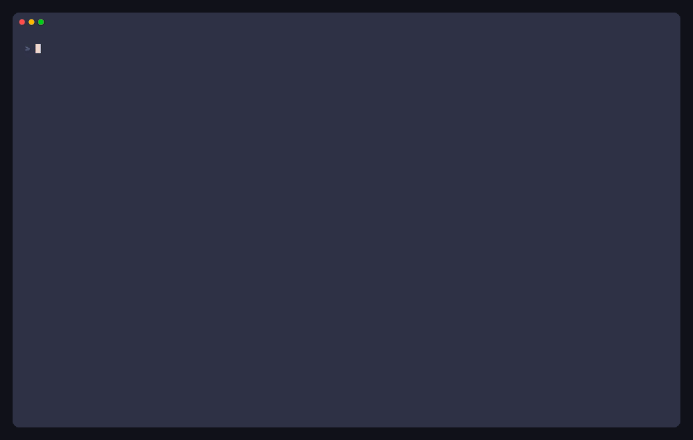

[](https://goreportcard.com/report/github.com/blacknon/lssh)
[](./internal/version/main.go)
[](./go.mod)
[](./cmd/README.md)
[](./LICENSE.md)

lssh
====

<strong><code>ls</code> + <code>ssh</code> = <code>lssh</code></strong>

<p align="center">

</p>

Pick SSH hosts from your existing config in a TUI.
Open a shell, or run the same command on multiple hosts.

- works with your existing SSH config
- interactive host selection
- parallel command execution

## Install

### Homebrew

```bash
brew install blacknon/lssh/lssh
```

### Go

```bash
go install github.com/blacknon/lssh/cmd/lssh@latest
```

For more installation details, including other options and platform-specific notes, see [docs/install.md](./docs/install.md).

## Quick start

Already using `~/.ssh/config`?

Just run:

```bash
lssh
```

Want to generate an `lssh` config from your existing SSH config?

```bash id="w2e9m1"
lssh --generate-lssh-conf > ~/.lssh.toml
```

## Basic workflow

lssh is built for a simple workflow:

1. list hosts from SSH config
2. pick one or more hosts
3. open a shell or run a command

## Examples

<table>
  <tr>
    <td valign="top" width="50%">
      <strong>Interactive host picker</strong><br />
      Select one or more hosts from the TUI.
      <p>
        
      </p>
      <pre><code>lssh</code></pre>
    </td>
    <td valign="top" width="50%">
      <strong>Parallel command execution</strong><br />
      Pick hosts and run the same command across them.
      <p>
        
      </p>
      <pre><code>lssh -p tail -f /var/log/syslog</code></pre>
    </td>
  </tr>
  <tr>
    <td valign="top" width="50%">
      <strong>Mux workflow</strong><br />
      Open the multi-pane terminal workflow.
      <p>
        
      </p>
      <pre><code>lssh -P</code></pre>
    </td>
    <td valign="top" width="50%">
      <strong>Mux workflow with command</strong><br />
      Start the mux UI and launch a command immediately.
      <p>
        
      </p>
      <pre><code>lssh -P 'htop'</code></pre>
    </td>
  </tr>
</table>

You can still target a single host directly when you already know where to connect:

```bash
lssh -H my-server
```

For more details about config formats and settings, see [cmd/lssh/README.md](./cmd/lssh/README.md).

## Demo

Want to try `lssh` quickly with a ready-to-run local playground?
Start with [`demo/README.md`](./demo/README.md).
For the telnet connector + multi-hop provider flow, use [`demo-telnet-provider/README.md`](./demo-telnet-provider/README.md).

## OpenSSH config and lssh config

lssh supports both your existing OpenSSH config and its own `lssh` config format.

If you want to get started quickly, you can keep using `~/.ssh/config` as-is. If you want more advanced host metadata and workflow-oriented settings, you can use an `lssh` config instead.

You can also generate an `lssh` config from your existing SSH config:

```bash
lssh --generate-lssh-conf > ~/.lssh.toml
```

And even after moving to `lssh` config, you can still point it at your existing OpenSSH config to load hosts from there:

```toml
[sshconfig.default]
path = "~/.ssh/config"
```

For more details about config formats and settings, see [docs/configuration.md](./docs/configuration.md).

## Providers

`lssh` can work with more than static SSH config entries.
Providers let it pull hosts from external inventory sources, resolve secrets just before connect, or use non-SSH connection backends such as cloud-managed connectors.

Provider capabilities are grouped into a few roles:

- `inventory`: generate `server` entries from APIs or cloud inventories
- `connector`: define how a resolved target is actually reached
- `secret`: resolve `*_ref` values at execution time
- `mixed`: combine multiple roles in one provider implementation

This is what makes workflows such as cloud inventory lookup, secret-manager-backed credentials, and connector-backed sessions possible without hardcoding them into the base config format.

<table>
  <tr>
    <td valign="top" width="25%">
      <strong><a href="./provider/inventory/README.md">Inventory</a></strong><br />
      Generate <code>server</code> entries from cloud or API-backed inventories.
    </td>
    <td valign="top" width="25%">
      <strong><a href="./provider/connector/README.md">Connector</a></strong><br />
      Reach targets through connector-backed runtimes such as managed sessions.
    </td>
    <td valign="top" width="25%">
      <strong><a href="./provider/secret/README.md">Secret</a></strong><br />
      Resolve <code>*_ref</code> values from secret stores at execution time.
    </td>
    <td valign="top" width="25%">
      <strong><a href="./provider/mixed/README.md">Mixed</a></strong><br />
      Combine inventory, connector, or secret roles in one provider.
    </td>
  </tr>
</table>

For the provider architecture and protocol overview, start with [provider/README.md](./provider/README.md).

## Tools in the lssh suite

The lssh project includes multiple tools for SSH-centered workflows.

<table>
  <tr>
    <td valign="top" width="33%">
      <a href="./cmd/lssh/README.md"></a><br />
      <strong><a href="./cmd/lssh/README.md">lssh</a></strong><br />
      <code>core</code> / <code>stable</code><br />
      Interactive SSH access, parallel commands, and forwarding modes.
    </td>
    <td valign="top" width="33%">
      <a href="./cmd/lscp/README.md"></a><br />
      <strong><a href="./cmd/lscp/README.md">lscp</a></strong><br />
      <code>transfer</code> / <code>stable</code><br />
      SCP-style copy over SSH/SFTP, including remote-to-remote transfers.
    </td>
    <td valign="top" width="33%">
      <a href="./cmd/lsftp/README.md"></a><br />
      <strong><a href="./cmd/lsftp/README.md">lsftp</a></strong><br />
      <code>transfer</code> / <code>stable</code><br />
      Interactive SFTP shell for browsing and transferring files.
    </td>
  </tr>
  <tr>
    <td valign="top" width="33%">
      <strong><a href="./cmd/lssync/README.md">lssync</a></strong><br />
      <code>transfer</code> / <code>beta</code><br />
      Tree sync over SSH/SFTP with daemon and bidirectional modes.
    </td>
    <td valign="top" width="33%">
      <strong><a href="./cmd/lsshfs/README.md">lsshfs</a></strong><br />
      <code>transfer</code> / <code>beta</code><br />
      Mount a remote directory through FUSE on Linux or NFS on macOS.
    </td>
    <td valign="top" width="33%">
      <a href="./cmd/lsdiff/README.md"></a><br />
      <strong><a href="./cmd/lsdiff/README.md">lsdiff</a></strong><br />
      <code>sysadmin</code> / <code>beta</code><br />
      Compare remote files from multiple hosts in a synchronized TUI.
    </td>
  </tr>
  <tr>
    <td valign="top" width="33%">
      <a href="./cmd/lsshell/README.md"></a><br />
      <strong><a href="./cmd/lsshell/README.md">lsshell</a></strong><br />
      <code>sysadmin</code> / <code>beta</code><br />
      Parallel interactive shell with broadcast and targeted commands.
    </td>
    <td valign="top" width="33%">
      <a href="./cmd/lsmux/README.md"></a><br />
      <strong><a href="./cmd/lsmux/README.md">lsmux</a></strong><br />
      <code>sysadmin</code> / <code>beta</code><br />
      Pane-based SSH workspace for multi-host terminal workflows.
    </td>
    <td valign="top" width="33%">
      <strong><a href="./cmd/lspipe/README.md">lspipe</a></strong><br />
      <code>sysadmin</code> / <code>alpha</code><br />
      Persistent host sessions reusable from local pipelines and automation.
    </td>
  </tr>
  <tr>
    <td valign="top" width="33%">
      <a href="./cmd/lsmon/README.md"></a><br />
      <strong><a href="./cmd/lsmon/README.md">lsmon</a></strong><br />
      <code>monitor</code> / <code>beta</code><br />
      Multi-host monitoring UI over SSH without extra remote agents.
    </td>
    <td valign="top" width="33%"></td>
    <td valign="top" width="33%"></td>
  </tr>
</table>


## Docs

- [docs/README.md](./docs/README.md): documentation index
- [cmd/lssh/README.md](./cmd/lssh/README.md): `lssh` command details, forwarding, and local rc usage
- [cmd/README.md](./cmd/README.md): command overview
- [CONTRIBUTING.md](./CONTRIBUTING.md): development and contribution guidelines

## Related projects

- [go-sshlib](https://github.com/blacknon/go-sshlib): Go library for SSH connections, command execution, and interactive shells
- [tvxterm](https://github.com/blacknon/tvxterm): tvxterm provides terminal widgets for tview

## Licence

[MIT](LICENSE.md)

## Author

[blacknon](https://github.com/blacknon)
