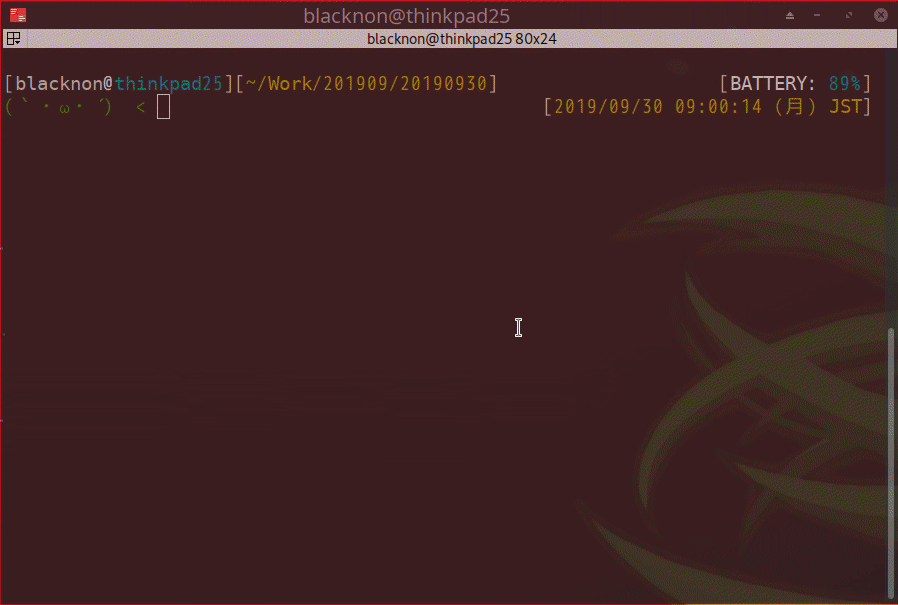
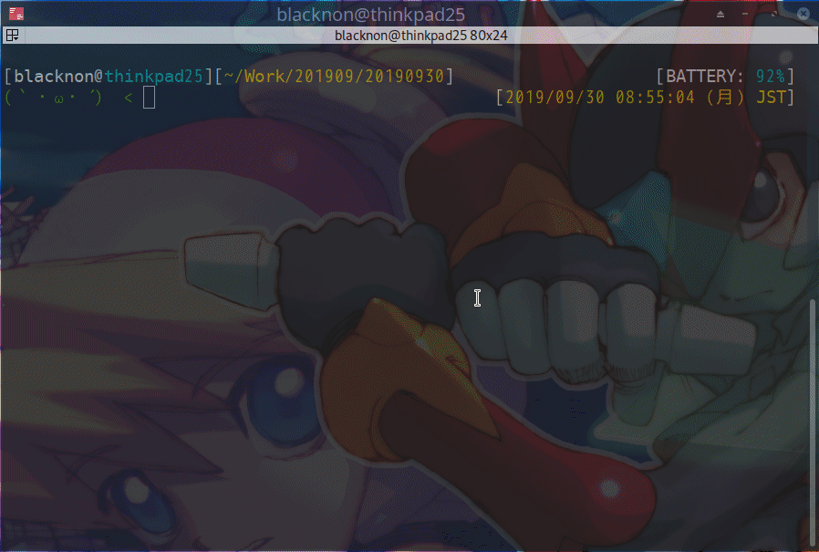

lssh
====

TUI list select ssh/scp/sftp client tools.

## Description

This command utility to read a prepared list in advance and connect ssh/scp/sftp the selected host.
List file is set in toml format.
When selecting a host, you can filter by keywords.
Can execute commands concurrently to multiple hosts.

lsftp shells can be connected in parallel.

Supported multiple ssh proxy, http/socks5 proxy, x11 forward, and port forwarding.

## Features

* List selection type Pure Go ssh client.
* It can run on **Linux**, **macOS** and **Windows**.
* Commands can be executed by ssh connection in **parallel**.
* There is a shell function that connects to multiple hosts in parallel for interactive operation and connects with local commands via pipes.
* Supported multiple proxy, **ssh**, **http**, and **socks5** proxy. It's supported multi-stage proxy.
* Supported **ssh-agent**.
* Supported **Local** and **Remote Port forward**, **Dynamic Forward(SOCKS5, http)**, **Reverse Dynamic Forward(SOCKS5, http)** and **x11 forward**.
* Supported KnownHosts.
* Supported ControlMaster and ControlPersist (OpenSSH incompatibility).
* By using **NFS Forward**/**NFS Reverse Forward**, the NFS server starts listening to the PATH of the local host or remote machine, making it available via local port forwarding.
* Can use bashrc of local machine at ssh connection destination.
* It supports various authentication methods. Password, Public key, Certificate and PKCS11(Yubikey etc.).
* Can read the OpenSSH config (~/.ssh/config) and use it as it is.

## Demo

## Install

### compile

compile gofile(tested go1.22.5).

    GO111MODULE=auto go get -u github.com/blacknon/lssh/cmd/lssh
    GO111MODULE=auto go get -u github.com/blacknon/lssh/cmd/lscp
    GO111MODULE=auto go get -u github.com/blacknon/lssh/cmd/lsftp

    # copy sample config. create `~/.lssh.conf`.
    test -f ~/.lssh.conf||curl -s https://raw.githubusercontent.com/blacknon/lssh/master/example/config.tml -o ~/.lssh.conf

or

    git clone https://github.com/blacknon/lssh
    cd lssh
    GO111MODULE=auto make && sudo make install

    # copy sample config. create `~/.lssh.conf`.
    test -f ~/.lssh.conf||curl -s https://raw.githubusercontent.com/blacknon/lssh/master/example/config.tml -o ~/.lssh.conf

### brew install

brew install(Mac OS X)

	brew tap blacknon/lssh
	brew install lssh

	# copy sample config. create `~/.lssh.conf`.
	test -f ~/.lssh.conf||curl -s https://raw.githubusercontent.com/blacknon/lssh/master/example/config.tml -o ~/.lssh.conf

## Config

Please edit "~/.lssh.conf".\
For details see [wiki](https://github.com/blacknon/lssh/wiki/Config).

## Usage

### 2. [lssh] run command (with parallel)

It is possible to execute by specifying command in argument.\
Parallel execution can be performed by adding the `-p` option.

	# exec command over ssh.
	lssh <command...>

	# exec command over ssh, parallel.
	lssh -p <command>

In parallel connection mode (`-p` option), Stdin can be sent to each host.\

Can be piped to send Stdin.

	# You can pass values ​​in a pipe
	command... | lssh <command...>

### 3. [lscp] scp (local=>remote(multi), remote(multi)=>local, remote=>remote(multi))

You can do scp by selecting a list with the command lscp.\
You can select multiple connection destinations. This program use sftp protocol.

`local => remote(multiple)`

    # lscp local => remote(multiple)
    lscp /path/to/local... r:/path/to/remote

`remote(multiple) => local`

    # lscp remote(multiple) => local
    lscp r:/path/to/remote... /path/to/local

`remote => remote(multiple)`

    # lscp remote => remote(multiple)
    lscp r:/path/to/remote... r:/path/to/local

### 4. [lsftp] sftp (local=>remote(multi), remote(multi)=>local)

You can do sftp by selecting a list with the command lstp.\
You can select multiple connection destinations.

`lsftp`

### 5. include ~/.ssh/config file.

Load and use `~/.ssh/config` by default.\
`ProxyCommand` can also be used.

Alternatively, you can specify and read the path as follows: In addition to the path, ServerConfig items can be specified and applied collectively.

	[sshconfig.default]
	path = "~/.ssh/config"
	pre_cmd = 'printf "\033]50;SetProfile=local\a"'
	post_cmd = 'printf "\033]50;SetProfile=Default\a"'

### 6. include other ServerConfig file.

You can include server settings in another file.\
`common` settings can be specified for each file that you went out.

`~/.lssh.conf` example.

	[includes]
	path = [
    	 "~/.lssh.d/home.conf"
    	,"~/.lssh.d/cloud.conf"
	]

`~/.lssh.d/home.conf` example.

	[common]
	pre_cmd = 'printf "\033]50;SetProfile=dq\a"'       # iterm2 ssh theme
	post_cmd = 'printf "\033]50;SetProfile=Default\a"' # iterm2 local theme
	ssh_agent_key = ["~/.ssh/id_rsa"]
	ssh_agent = false
	user = "user"
	key = "~/.ssh/id_rsa"
	pkcs11provider = "/usr/local/lib/opensc-pkcs11.so"

	[server.Server1]
	addr = "172.16.200.1"
	note = "TEST Server1"
	local_rc = "yes"

	[server.Server2]
	addr = "172.16.200.2"
	note = "TEST Server2"
	local_rc = "yes"

The priority of setting values ​​is as follows.

`[server.hogehoge]` > `[common] at Include file` > `[common] at ~/.lssh.conf`

### 7. Supported Proxy

Supports multiple proxy.

* http
* socks5
* ssh

Besides this, you can also specify ProxyCommand like OpenSSH.

`http` proxy example.

	[proxy.HttpProxy]
	addr = "example.com"
	port = "8080"

	[server.overHttpProxy]
	addr = "over-http-proxy.com"
	key  = "/path/to/private_key"
	note = "connect use http proxy"
	proxy = "HttpProxy"
	proxy_type = "http"

`socks5` proxy example.

	[proxy.Socks5Proxy]
	addr = "example.com"
	port = "54321"

	[server.overSocks5Proxy]
	addr = "192.168.10.101"
	key  = "/path/to/private_key"
	note = "connect use socks5 proxy"
	proxy = "Socks5Proxy"
	proxy_type = "socks5"

`ssh` proxy example.

	[server.sshProxyServer]
	addr = "192.168.100.200"
	key  = "/path/to/private_key"
	note = "proxy server"

	[server.overProxyServer]
	addr = "192.168.10.10"
	key  = "/path/to/private_key"
	note = "connect use ssh proxy"
	proxy = "sshProxyServer"

	[server.overProxyServer2]
	addr = "192.168.10.100"
	key  = "/path/to/private_key"
	note = "connect use ssh proxy(multiple)"
	proxy = "overProxyServer"

`ProxyCommand` proxy example.

	[server.ProxyCommand]
	addr = "192.168.10.20"
	key  = "/path/to/private_key"
	note = "connect use ssh proxy(multiple)"
	proxy_cmd = "ssh -W %h:%p proxy"

### 8. Available authentication method

* Password auth
* Publickey auth
* Certificate auth
* PKCS11 auth
* Ssh-Agent auth

`password` auth example.

	[server.PasswordAuth]
	addr = "password_auth.local"
	user = "user"
	pass = "Password"
	note = "password auth server"

`publickey` auth example.

	[server.PublicKeyAuth]
	addr = "pubkey_auth.local"
	user = "user"
	key = "~/path/to/key"
	note = "Public key auth server"

	[server.PublicKeyAuth_with_passwd]
	addr = "password_auth.local"
	user = "user"
	key = "~/path/to/key"
	keypass = "passphrase"
	note = "Public key auth server with passphrase"

`cert` auth example.\
(pkcs11 key is not supported in the current version.)

	[server.CertAuth]
	addr = "cert_auth.local"
	user = "user"
	cert = "~/path/to/cert"
	certkey = "~/path/to/certkey"
	note = "Certificate auth server"

	[server.CertAuth_with_passwd]
	addr = "cert_auth.local"
	user = "user"
	cert = "~/path/to/cert"
	certkey = "~/path/to/certkey"
	certkeypass = "passphrase"
	note = "Certificate auth server with passphrase"

`pkcs11` auth example.

	[server.PKCS11Auth]
	addr = "pkcs11_auth.local"
	user = "user"
	pkcs11provider = "/usr/local/lib/opensc-pkcs11.so"
	pkcs11 = true
	note = "PKCS11 auth server"

	[server.PKCS11Auth_with_PIN]
	addr = "pkcs11_auth.local"
	user = "user"
	pkcs11provider = "/usr/local/lib/opensc-pkcs11.so"
	pkcs11 = true
	pkcs11pin = "123456"
	note = "PKCS11 auth server"

`ssh-agent` auth example.

	[server.SshAgentAuth]
	addr = "agent_auth.local"
	user = "user"
	agentauth = true # auth ssh-agent
	note = "ssh-agent auth server"

### 9. Port forwarding

Supported Local/Remote/Dynamic port forwarding.\
You can specify from the command line or from the configuration file.

When using NFS forward, lssh starts the NFS server and begins listening on the specified port.
After that, the forwarded PATH can be used as a mount point on the local machine or the remote machine.

#### command line option

    lssh -L 8080:localhost:80    # local port forwarding
    lssh -R 80:localhost:8080    # remote port forwarding
    lssh -D 10080                # dynamic port forwarding
    lssh -R 10080                # Reverse Dynamic port forwarding
	lssh -M port:/path/to/remote # NFS Dynamic forward.
	lssh -m port:/path/to/local  # NFS Reverse Dynamic forward.

#### config file

	[server.LocalPortForward]
	addr = "localforward.local"
	user = "user"
	agentauth = true
	port_forward_local = "localhost:8080"
	port_forward_remote = "localhost:80"
	note = "local port forwawrd example"

	[server.RemotePortForward]
	addr = "remoteforward.local"
	user = "user"
	agentauth = true
	port_forward = "REMOTE"
	port_forward_local = "localhost:80"
	port_forward_remote = "localhost:8080"
	note = "remote port forwawrd example"

	[server.DynamicForward]
	addr = "dynamicforward.local"
	user = "user"
	agentauth = true
	dynamic_port_forward = "11080"
	note = "dynamic forwawrd example"

	[server.ReverseDynamicForward]
	addr = "reversedynamicforward.local"
	user = "user"
	agentauth = true
	reverse_dynamic_port_forward = "11080"
	note = "reverse dynamic forwawrd example"

If OpenSsh config is loaded, it will be loaded as it is.

### 10. Check KnownHosts

Supported check KnownHosts.
If you want to enable check KnownHost, set `check_known_hosts` to `true` in Server Config.

If you want to specify a file to record KnownHosts, add file path to `known_hosts_files`.

	[server.CheckKnownHosts]
	addr = "check_knwon_hosts.local"
	user = "user"
	check_known_hosts = true
	note = "check known hosts example"

	[server.CheckKnownHostsToOriginalFile]
	addr = "check_knwon_hosts.local"
	user = "user"
	check_known_hosts = true
	known_hosts_files = ["/path/to/known_hosts"]
	note = "check known hosts example"

## Related projects

- [go-sshlib](https://github.com/blacknon/go-sshlib)
- [lsshell](https://github.com/blacknon/lsshell)
- [lsmon](https://github.com/blacknon/lsmon)

## Licence

A short snippet describing the license [MIT](https://github.com/blacknon/lssh/blob/master/LICENSE.md).

## Author

[blacknon](https://github.com/blacknon)
