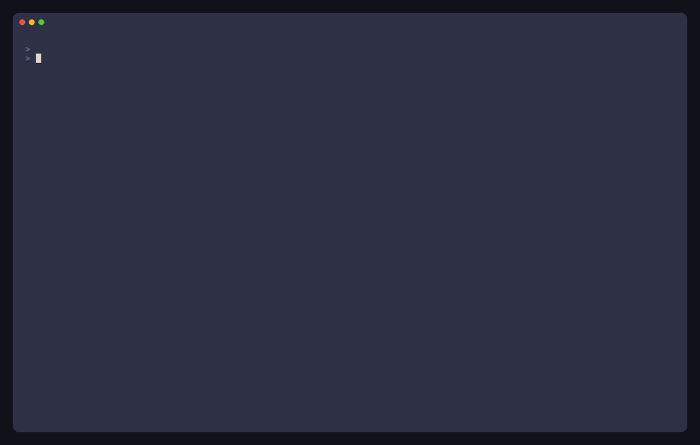
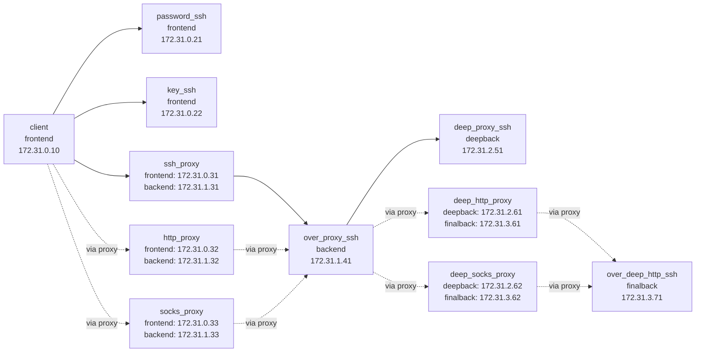

[](https://goreportcard.com/report/github.com/blacknon/lssh)

lssh
====

<strong><code>ls</code> + <code>ssh</code> = <code>lssh</code></strong>



TUI list pick host, and enter SSH hosts from your existing config.
Open a shell, or run the same command on multiple hosts.

- works with your existing SSH config
- interactive host selection
- parallel command execution

## Install

### Homebrew

```bash
brew install blacknon/lssh/lssh
```

### Go

```bash
go install github.com/blacknon/lssh/cmd/lssh@latest
```

For more installation details, including other options and platform-specific notes, see [docs/install.md](./docs/install.md).

## Quick start

If you already have `~/.ssh/config`, just run:

```bash
lssh
```

## Basic workflow

lssh is built for a simple workflow:

1. list hosts from SSH config
2. pick one or more hosts
3. open a shell or run a command

## Examples

Open the interactive host picker:

```bash
lssh
lssh -P # mux
```

Connect to a specific host:

```bash
lssh -H my-server
```

Run the same command on multiple hosts:

```bash
lssh uname -a
```

Run a command after selecting hosts interactively:

```bash
# output stdout
lssh -p uptime -a
lssh -p tail -f /var/log/syslog

# output mux
lssh -P htop
lssh -P tail -f /var/log/syslog
```

## Demo


```mermaid
flowchart LR
    client["client
frontend
172.31.0.10"]
    password_ssh["password_ssh
frontend
172.31.0.21"]
    key_ssh["key_ssh
frontend
172.31.0.22"]
    over_proxy_ssh["over_proxy_ssh
backend
172.31.1.41"]
    deep_proxy_ssh["deep_proxy_ssh
deepback
172.31.2.51"]
    deep_http_proxy["deep_http_proxy
deepback: 172.31.2.61
finalback: 172.31.3.61"]
    deep_socks_proxy["deep_socks_proxy
deepback: 172.31.2.62
finalback: 172.31.3.62"]
    over_deep_http_ssh["over_deep_http_ssh
finalback
172.31.3.71"]

    ssh_proxy["ssh_proxy
frontend: 172.31.0.31
backend: 172.31.1.31"]
    http_proxy["http_proxy
frontend: 172.31.0.32
backend: 172.31.1.32"]
    socks_proxy["socks_proxy
frontend: 172.31.0.33
backend: 172.31.1.33"]

    client --> password_ssh
    client --> key_ssh
    client --> ssh_proxy
    client -. via proxy .-> http_proxy
    client -. via proxy .-> socks_proxy

    ssh_proxy --> over_proxy_ssh
    http_proxy -. via proxy .->  over_proxy_ssh
    socks_proxy -. via proxy .->  over_proxy_ssh
    over_proxy_ssh --> deep_proxy_ssh
    over_proxy_ssh -. via proxy .->  deep_http_proxy
    over_proxy_ssh -. via proxy .->  deep_socks_proxy
    deep_http_proxy -. via proxy .->  over_deep_http_ssh
    deep_socks_proxy -. via proxy .->  over_deep_http_ssh
```

Want to try `lssh` quickly with a ready-to-run local playground?
Start with [`demo/README.md`](./demo/README.md).

## OpenSSH config and lssh config

lssh supports both your existing OpenSSH config and its own `lssh` config format.

If you want to get started quickly, you can keep using `~/.ssh/config` as-is. If you want more advanced host metadata and workflow-oriented settings, you can use an `lssh` config instead.

You can also generate an `lssh` config from your existing SSH config:

```bash
lssh --generate-lssh-conf > ~/.lssh.toml
```

And even after moving to `lssh` config, you can still point it at your existing OpenSSH config to load hosts from there:

```toml
[sshconfig.default]
path = "~/.ssh/config"
```

For more details about config formats and settings, see [docs/configuration.md](./docs/configuration.md).

## Tools in the lssh suite

The lssh project includes multiple tools for SSH-centered workflows.

| Command | Category | Maturity | Supported OS | About | README |
| --- | --- | --- | --- | --- | --- |
| `lssh` | `core` | `stable` | Linux / macOS / Windows | The main command in the suite, with interactive SSH access, parallel remote command execution, and multiple forwarding modes. | [cmd/lssh/README.md](./cmd/lssh/README.md) |
| `lscp` | `transfer` | `stable` | Linux / macOS / Windows | An SCP-style file copy command that transfers files over SSH using SFTP, with support for local-to-remote, remote-to-local, and remote-to-remote copies. | [cmd/lscp/README.md](./cmd/lscp/README.md) |
| `lsftp` | `transfer` | `stable` | Linux / macOS / Windows | An interactive SFTP shell for browsing remote files, managing directories, and transferring data across one or more hosts from a single prompt. | [cmd/lsftp/README.md](./cmd/lsftp/README.md) |
| `lssync` | `transfer` | `beta` | Linux / macOS / Windows | A one-way sync command over SSH/SFTP that mirrors a source tree to a destination tree and can remove extra destination files with `--delete`. | [cmd/lssync/README.md](./cmd/lssync/README.md) |
| `lsdiff` | `sysadmin` | `beta` | Linux / macOS / Windows | A synchronized TUI diff viewer that fetches remote files from multiple hosts over SSH/SFTP and compares them side by side. | [cmd/lsdiff/README.md](./cmd/lsdiff/README.md) |
| `lsshfs` | `transfer` | `beta` | Linux / macOS | A single-host mount command that uses FUSE on Linux and NFS on macOS so remote files can be mounted with the same inventory. Windows is not supported in `0.9.0`. | [cmd/lsshfs/README.md](./cmd/lsshfs/README.md) |
| `lsshell` | `sysadmin` | `beta` | Linux / macOS / Windows | A parallel interactive shell for working across multiple hosts at once, with support for broadcasting commands, targeting specific hosts, and combining pipelines with the local host. | [cmd/lsshell/README.md](./cmd/lsshell/README.md) |
| `lsmux` | `sysadmin` | `beta` | Linux / macOS / Windows | A pane-based, tmux-like SSH workspace for keeping multiple remote sessions visible at once and running commands in a split-terminal layout. | [cmd/lsmux/README.md](./cmd/lsmux/README.md) |
| `lspipe` | `sysadmin` | `alpha` | Linux / macOS / Windows (`--mkfifo` is Unix-only) | A persistent pipe-oriented runner that keeps a selected host set in the background and lets you reuse it from local shell pipelines. Session-based execution works on Windows, but FIFO bridge features are Unix-only. | [cmd/lspipe/README.md](./cmd/lspipe/README.md) |
| `lsmon` | `monitor` | `beta` | Linux / macOS / Windows | A multi-host monitoring TUI that shows CPU, memory, disk, network, and process information over SSH, and can open a terminal to the selected host without requiring agents on the remote hosts. | [cmd/lsmon/README.md](./cmd/lsmon/README.md) |


## Docs

- [docs/README.md](./docs/README.md): documentation index
- [cmd/lssh/README.md](./cmd/lssh/README.md): `lssh` command details, forwarding, and local rc usage
- [cmd/README.md](./cmd/README.md): command overview

## Related projects

- [go-sshlib](https://github.com/blacknon/go-sshlib): Go library for SSH connections, command execution, and interactive shells

## Licence

[MIT](LICENSE.md)

## Author

[blacknon](https://github.com/blacknon)
