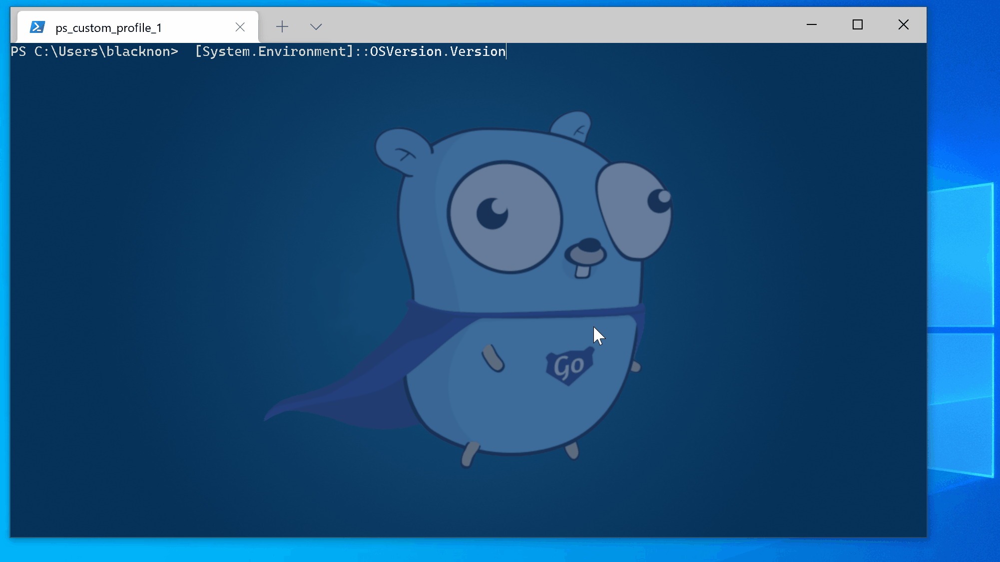

[](https://goreportcard.com/report/github.com/blacknon/lssh)

lssh
====

<p align="center">
  
  
  
</p>

lssh is a pure Go, list-oriented SSH toolkit that lets you select hosts from a TOML-defined inventory and connect with SSH, SCP, or SFTP. It is designed for interactive and parallel operations across multiple servers, with support for multi-stage proxies, port forwarding, ssh-agent, OpenSSH config import, and cross-platform use on Linux, macOS, and Windows.

## Description

### Features

- Pure Go SSH toolkit with cross-platform support for Linux, macOS, and Windows
- Host inventory defined in TOML, with interactive filtering and selection
- SSH, SCP, and SFTP workflows from a single tool suite
- Parallel operations across multiple hosts, including command execution and interactive shells
- Support for multi-stage proxy chains over SSH, HTTP, and SOCKS5
- Port forwarding features including local, remote, dynamic, reverse dynamic, and X11 forwarding
- NFS forwarding features for exporting remote paths locally and reverse-mounting local paths to remote hosts
- Authentication support for password, public key, certificate, PKCS#11, and `ssh-agent`
- OpenSSH config import, known_hosts support
- ControlMaster/ControlPersist session reuse


### Commands

The `lssh` suite provides multiple commands for different SSH-related workflows. Use the table below to choose the right command for your task and jump to its dedicated README.

| Command | Best for | Overview |
| --- | --- | --- |
| [lssh](./cmd/lssh/README.md) | Interactive SSH access and port forwarding | TUI-based SSH client for host selection, interactive login, parallel command execution, and forwarding features. |
| [lsftp](./cmd/lsftp/README.md) | Interactive file operations over SFTP | Interactive SFTP shell for browsing directories, transferring files, and managing one or more hosts together. |
| [lscp](./cmd/lscp/README.md) | SCP-style file transfer | File transfer command for local-to-remote, remote-to-local, and remote-to-remote copy operations over SSH. |
| [lsshell](./cmd/lsshell/README.md) | Sending commands to multiple hosts | Parallel interactive shell that can broadcast commands to selected hosts from a single prompt. |
| [lsmon](./cmd/lsmon/README.md) | Monitoring multiple remote hosts | TUI monitor that displays CPU, memory, disk, network, and process information from multiple hosts side by side. |


## Demo

The animations at the top of this README show `lssh` running on macOS, Linux, and Windows.

If you want to try the main connection patterns locally, see [demo/README.md](./demo/README.md). It provides a Docker Compose based demo environment with ready-to-use sample hosts, proxy routes, and client configuration.

## Install

You can install `lssh` with `go install`, Homebrew, or by building from source.

### Prebuilt binaries

Prebuilt binaries are available on GitHub Releases.

#### Linux (amd64, tar.gz)

<details>

Install to `/usr/local/bin`:

```bash id="1c8m19"
VERSION=0.7.1
curl -fL -o /tmp/lssh.tar.gz \
  "https://github.com/blacknon/lssh/releases/download/v${VERSION}/lssh_${VERSION}_linux_amd64.tar.gz"
sudo tar -xzf /tmp/lssh.tar.gz -C /tmp
sudo install -m 0755 /tmp/lssh_${VERSION}_linux_amd64/bin/* /usr/local/bin/
```

</details>

#### Debian / Ubuntu (.deb)

<details>

```bash
VERSION=0.7.1
curl -fL -o /tmp/lssh.deb \
  "https://github.com/blacknon/lssh/releases/download/v${VERSION}/lssh_${VERSION}_amd64.deb"
sudo apt install /tmp/lssh.deb
```

</details>

#### RHEL / Fedora / Rocky / AlmaLinux (.rpm)

<details>

```bash
VERSION=0.7.1
curl -fL -o /tmp/lssh.rpm \
  "https://github.com/blacknon/lssh/releases/download/v${VERSION}/lssh-${VERSION}-1.x86_64.rpm"
sudo dnf install -y /tmp/lssh.rpm
```

</details>

#### Package layout

`lssh` provides both a full suite package and smaller split packages.

| Package | Includes | Best for |
| --- | --- | --- |
| `lssh_*` | `lssh`, `lscp`, `lsftp`, `lsmon`, `lsshell` | Full installation of the entire tool suite |
| `lssh-core_*` | `lssh` | SSH access and forwarding only |
| `lssh-transfer_*` | `lscp`, `lsftp` | File transfer workflows only |
| `lssh-monitor_*` | `lsmon` | Monitoring multiple remote hosts |
| `lssh-sysadmin_*` | `lsshell` | Parallel shell / multi-host operations |


### go install

Install the latest version directly with Go.

```bash
go install github.com/blacknon/lssh/cmd/lssh@latest
go install github.com/blacknon/lssh/cmd/lscp@latest
go install github.com/blacknon/lssh/cmd/lsftp@latest
go install github.com/blacknon/lssh/cmd/lsshell@latest
go install github.com/blacknon/lssh/cmd/lsmon@latest
```

### brew install

Install with Homebrew on macOS.

```bash
brew install blacknon/lssh/lssh
```

### build from source

Build from the repository when you want to work from the local source tree.

```bash
git clone https://github.com/blacknon/lssh.git
cd lssh
make build
sudo make install
```

## Usage

This section describes shared configuration features used across the `lssh` suite.
For command-specific features and CLI usage, see [cmd/README.md](cmd/README.md) and the README in each command directory.

### TUI navigation and key bindings

<details>

Most `lssh` commands open the same host selection TUI when you do not pass hosts with `-H`.
You can filter the list by typing, then move and confirm the selection from the keyboard.

- <kbd>Up</kbd> / <kbd>Down</kbd>: move the cursor one line
- <kbd>Left</kbd> / <kbd>Right</kbd>: move between pages
- <kbd>Tab</kbd>: toggle the current host and move to the next line in multi-select screens
- <kbd>Ctrl</kbd> + <kbd>A</kbd>: select or unselect all visible hosts in multi-select screens
- <kbd>Backspace</kbd>: delete one character from the current filter
- <kbd>Space</kbd>: insert a space into the filter text
- <kbd>Enter</kbd>: confirm the current selection
- <kbd>Esc</kbd> or `Ctrl + C`: quit immediately

Mouse left click also moves the cursor to the clicked line.

`lsmon` adds one extra key binding after startup:

- `Ctrl + X`: toggle the top-panel view for the currently selected host

</details>

### shared host inventory
<details>

`lssh` reads `~/.lssh.conf` by default.
You can define shared settings in `[common]` and host entries in `[server.<name>]`.
Values in `[server.<name>]` override values from `[common]`.

Minimal example.

```toml
[common]
user = "demo"
port = "22"
key = "~/.ssh/id_rsa"

[server.dev]
addr = "192.168.100.10"
note = "development server"
```

At minimum, a server entry needs `addr`, `user`, and authentication settings such as `pass`, `key`, `cert`, `pkcs11`, or `agentauth`.

</details>

### keepalive settings
<details>

You can configure SSH keepalive probes with `alive_interval` and `alive_max`.
These behave like OpenSSH `ServerAliveInterval` and `ServerAliveCountMax`.

```toml
[common]
alive_interval = 10
alive_max = 3
```

With the example above, `lssh` sends a keepalive request every 10 seconds and closes the connection after 3 consecutive failures.

</details>

### OpenSSH config import
<details>

Load and use `~/.ssh/config` by default.\
`ProxyCommand` can also be used.

Alternatively, you can specify and read the path as follows: In addition to the path, ServerConfig items can be specified and applied collectively.

```toml
[sshconfig.default]
path = "~/.ssh/config"
pre_cmd = 'printf "\033]50;SetProfile=local\a"'
post_cmd = 'printf "\033]50;SetProfile=Default\a"'
```

</details>

### split config into multiple files
<details>

You can include server settings in another file.\
`common` settings can be specified for each file that you went out.

`~/.lssh.conf` example.

```toml
[includes]
path = [
	 "~/.lssh.d/home.conf"
	,"~/.lssh.d/cloud.conf"
]
```

`~/.lssh.d/home.conf` example.

```toml
[common]
pre_cmd = 'printf "\033]50;SetProfile=dq\a"'       # iterm2 ssh theme
post_cmd = 'printf "\033]50;SetProfile=Default\a"' # iterm2 local theme
ssh_agent_key = ["~/.ssh/id_rsa"]
ssh_agent = false
user = "user"
key = "~/.ssh/id_rsa"
pkcs11provider = "/usr/local/lib/opensc-pkcs11.so"

[server.Server1]
addr = "172.16.200.1"
note = "TEST Server1"
local_rc = "yes"

[server.Server2]
addr = "172.16.200.2"
note = "TEST Server2"
local_rc = "yes"
```

The priority of setting values ​​is as follows.

`[server.hogehoge]` > `[common] at Include file` > `[common] at ~/.lssh.conf`


</details>

### multi-stage proxy
<details>

Supports multiple proxy.

* http
* socks5
* ssh

Besides this, you can also specify ProxyCommand like OpenSSH.

`http` proxy example.

```toml
[proxy.HttpProxy]
addr = "example.com"
port = "8080"

[server.overHttpProxy]
addr = "over-http-proxy.com"
key  = "/path/to/private_key"
note = "connect use http proxy"
proxy = "HttpProxy"
proxy_type = "http"
```


`socks5` proxy example.

```toml
[proxy.Socks5Proxy]
addr = "example.com"
port = "54321"

[server.overSocks5Proxy]
addr = "192.168.10.101"
key  = "/path/to/private_key"
note = "connect use socks5 proxy"
proxy = "Socks5Proxy"
proxy_type = "socks5"
```

`ssh` proxy example.

```toml
[server.sshProxyServer]
addr = "192.168.100.200"
key  = "/path/to/private_key"
note = "proxy server"

[server.overProxyServer]
addr = "192.168.10.10"
key  = "/path/to/private_key"
note = "connect use ssh proxy"
proxy = "sshProxyServer"

[server.overProxyServer2]
addr = "192.168.10.100"
key  = "/path/to/private_key"
note = "connect use ssh proxy(multiple)"
proxy = "overProxyServer"
```

`ProxyCommand` proxy example.

```toml
[server.ProxyCommand]
addr = "192.168.10.20"
key  = "/path/to/private_key"
note = "connect use ssh proxy(multiple)"
proxy_cmd = "ssh -W %h:%p proxy"
```

</details>


### available authentication methods
<details>

* Password auth
* Publickey auth
* Certificate auth
* PKCS11 auth
* Ssh-Agent auth

`password` auth example.

```toml
[server.PasswordAuth]
addr = "password_auth.local"
user = "user"
pass = "Password"
note = "password auth server"
```

`publickey` auth example.

```toml
[server.PublicKeyAuth]
addr = "pubkey_auth.local"
user = "user"
key = "~/path/to/key"
note = "Public key auth server"

[server.PublicKeyAuth_with_passwd]
addr = "password_auth.local"
user = "user"
key = "~/path/to/key"
keypass = "passphrase"
note = "Public key auth server with passphrase"
```

`cert` auth example.\
(pkcs11 key is not supported in the current version.)

```toml
[server.CertAuth]
addr = "cert_auth.local"
user = "user"
cert = "~/path/to/cert"
certkey = "~/path/to/certkey"
note = "Certificate auth server"

[server.CertAuth_with_passwd]
addr = "cert_auth.local"
user = "user"
cert = "~/path/to/cert"
certkey = "~/path/to/certkey"
certkeypass = "passphrase"
note = "Certificate auth server with passphrase"
```

`pkcs11` auth example.

```toml
[server.PKCS11Auth]
addr = "pkcs11_auth.local"
user = "user"
pkcs11provider = "/usr/local/lib/opensc-pkcs11.so"
pkcs11 = true
note = "PKCS11 auth server"

[server.PKCS11Auth_with_PIN]
addr = "pkcs11_auth.local"
user = "user"
pkcs11provider = "/usr/local/lib/opensc-pkcs11.so"
pkcs11 = true
pkcs11pin = "123456"
note = "PKCS11 auth server"
```

`ssh-agent` auth example.

```toml
[server.SshAgentAuth]
addr = "agent_auth.local"
user = "user"
agentauth = true # auth ssh-agent
note = "ssh-agent auth server"
```

</details>

### check KnownHosts
<details>

Supported check KnownHosts.
If you want to enable check KnownHost, set `check_known_hosts` to `true` in Server Config.

If you want to specify a file to record KnownHosts, add file path to `known_hosts_files`.

```toml
[server.CheckKnownHosts]
addr = "check_knwon_hosts.local"
user = "user"
check_known_hosts = true
note = "check known hosts example"

[server.CheckKnownHostsToOriginalFile]
addr = "check_knwon_hosts.local"
user = "user"
check_known_hosts = true
known_hosts_files = ["/path/to/known_hosts"]
note = "check known hosts example"
```

</details>

### ControlMaster / ControlPersist
<details>

You can reuse SSH sessions with OpenSSH-style ControlMaster settings.
This is useful when multiple operations connect to the same host repeatedly.

`~/.lssh.conf` example.

```toml
[common]
control_master = true
control_path = "/tmp/lssh-control-%h-%p-%r"
control_persist = "10m"

[server.controlmaster]
addr = "192.168.100.110"
user = "demo"
key = "~/.ssh/id_rsa"
note = "reuse ssh session"
```

</details>

## Related projects

- [go-sshlib](https://github.com/blacknon/go-sshlib) ... A Go library for SSH connections, command execution, and interactive shell handling.

## Licence

A short snippet describing the license [MIT](LICENSE.md).

## Author

[blacknon](https://github.com/blacknon)
