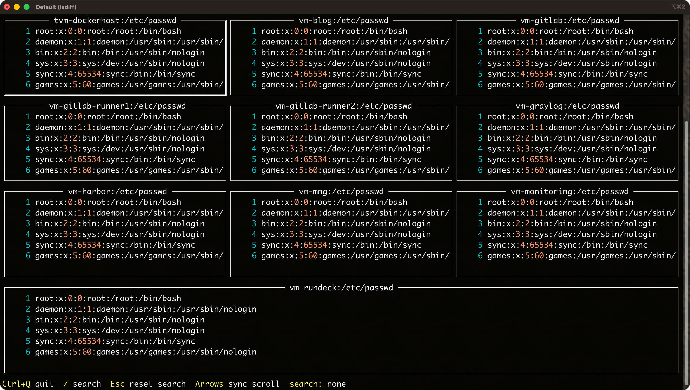

lsdiff
======

<p align="center">

</p>

## About

`lsdiff` fetches remote files over SSH/SFTP and compares them side by side in a synchronized `tview` UI.
It is useful when you want the same file from multiple hosts on one screen without copying those files locally first.
You can either compare the same remote path across hosts chosen from the selector, or pass explicit `@host:/path` targets on the command line.

## Usage

```shell
$ lsdiff --help
NAME:
    lsdiff - Compare remote files from multiple SSH hosts in a synchronized TUI.
USAGE:
    lsdiff [options] remote_path | @host:/path...

OPTIONS:
    --file filepath, -F filepath        config filepath. (default: "/Users/blacknon/.lssh.conf")
    --generate-lssh-conf ~/.ssh/config  print generated lssh config from OpenSSH config to stdout (~/.ssh/config by default).
    --help, -h                          print this help
    --enable-control-master             temporarily enable ControlMaster for this command execution
    --disable-control-master            temporarily disable ControlMaster for this command execution
    --version, -v                       print the version

VERSION:
    lssh-suite 0.9.1 (beta/sysadmin)

USAGE:
    # select multiple hosts and compare the same remote path
    lsdiff /etc/hosts

    # compare different paths on specific hosts
    lsdiff @host1:/etc/hosts @host2:/etc/hosts @host3:/tmp/hosts

```

## Overview

### compare the same path across multiple hosts

When you pass a single remote path like `/etc/hosts`, `lsdiff` opens the usual host selector and asks you to choose at least two hosts.
It then fetches that same path from each host and aligns the content into a synchronized multi-pane diff view.

```bash
# select multiple hosts, compare the same remote path
lsdiff /etc/hosts
```

### compare explicit host and path pairs

You can skip the selector and compare exact host/path pairs directly from the command line.
This is useful when the filenames differ slightly across hosts, or when you want to compare files that are not stored under the same path.

```bash
# compare explicit host/path combinations
lsdiff @host1:/etc/hosts @host2:/etc/hosts @host3:/tmp/hosts
```

### synchronized viewer controls

The viewer keeps scroll positions aligned across panes, so it is easier to inspect the same region of each file side by side.

- `Up` / `Down`: synchronized vertical scroll across all panes
- `Left` / `Right`: synchronized horizontal scroll across all panes
- `/`: open search prompt
- `Esc`: clear search
- `Ctrl+Q`: quit

### notes

- `lsdiff` requires at least two targets.
- In common-path mode, host selection uses the existing `lssh` host selector and requires selecting at least two hosts.
- The compare layout aligns lines using a vimdiff-like base-file alignment so three or more files can be viewed together.
- The default config search order is `~/.lssh.toml`, `~/.lssh.yaml`, `~/.lssh.yml`, then `~/.lssh.conf`.
