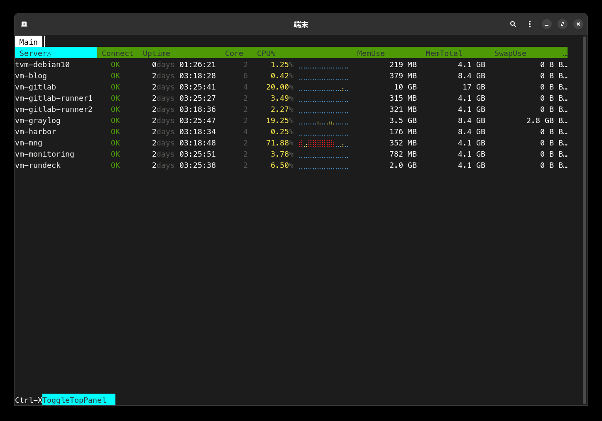
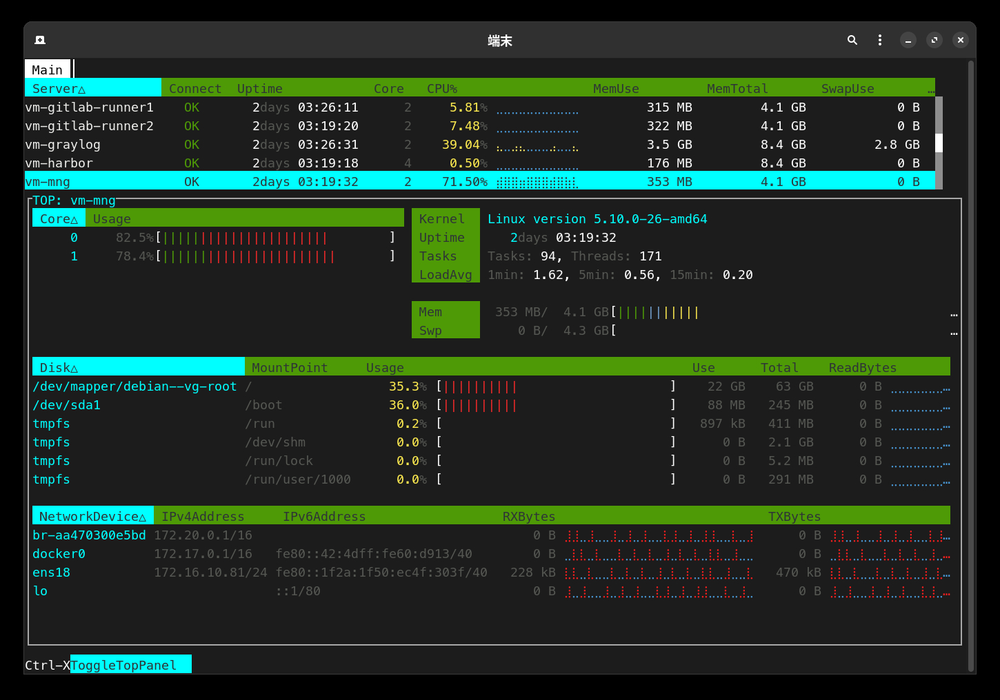
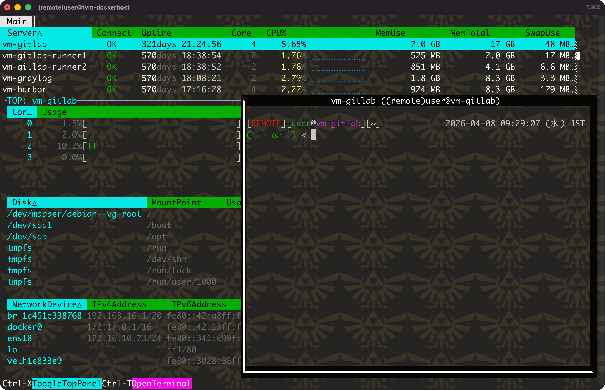

lsmon
===

<p align="center">
  
  
</p>


## About

`lsmon` is a TUI monitor for watching multiple remote hosts side by side.
It connects over SSH and shows system information such as CPU, memory, disk, network, and process status in one screen.
Monitoring works by periodically reading `/proc` over the SFTP protocol, so no extra commands or agents need to be installed on the target hosts.

## Usage

```shell
$ lsmon --help
NAME:
    lsmon - TUI list select and parallel ssh monitoring command.
USAGE:
    lsmon [options] [commands...]

OPTIONS:
    --host servername, -H servername  connect servername.
    --file filepath, -F filepath      config filepath. (default: "/Users/blacknon/.lssh.conf")
    --logfile value, -L value         Set log file path.
    --share-connect, -s               reuse the monitor SSH connection for terminals.
    --list, -l                        print server list from config.
    --debug                           debug pprof. use port 6060.
    --help, -h                        print this help
    --version, -v                     print the version

COPYRIGHT:
    blacknon(blacknon@orebibou.com)

VERSION:
    lssh-suite 0.8.0 (beta/monitor)

USAGE:
    # connect parallel ssh monitoring command
  lsmon

```

## OverView

### monitor targets

`lsmon` can monitor multiple hosts selected from the TUI list, or you can specify them directly with `-H`.
It is designed for comparing host state across a server list.

```bash
# start monitoring after selecting hosts from the TUI
lsmon

# specify hosts directly
lsmon -H web01 -H web02
```

### htop like viewer

Press `Ctrl + X` to open a top-screen-style window.

### Open Terminal

<p align="center">
  
</p>

In the htop-like viewer, press `Ctrl + T` to open a terminal for the selected host.
This lets you move directly from monitoring to interactive shell access without leaving the viewer.

By default, this terminal opens a separate SSH connection so interactive work stays isolated from the monitor.
If you want the terminal to reuse the monitor connection instead, start `lsmon` with `--share-connect` or `-s`.

### metrics

The monitor displays the following kinds of information

- uptime
- load average
- CPU usage and core count
- memory and swap usage
- disk usage and disk I/O
- network throughput and packet counts
- process information

### logging and debug

You can write logs to a file with `-L`.
You can also enable `pprof` on `localhost:6060` with `--debug`.

```bash
# write monitor logs to a file
lsmon -L ./lsmon.log

# enable pprof for debugging
lsmon --debug
```

### notes

The default config search order is `~/.lssh.toml`, `~/.lssh.yaml`, `~/.lssh.yml`, then `~/.lssh.conf`.
If no log file is specified, logs are written to `/dev/null`.

Most data collection assumes Linux-style `/proc` information on the remote side, so in practice `lsmon` is aimed at Linux hosts.
The SSH connect timeout is set to 5 seconds in the current implementation.
