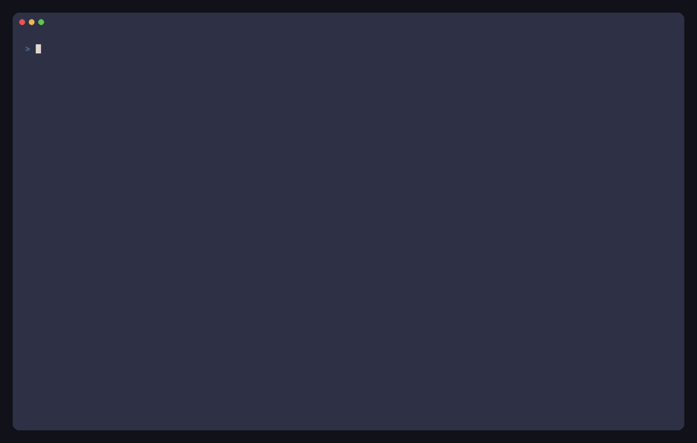
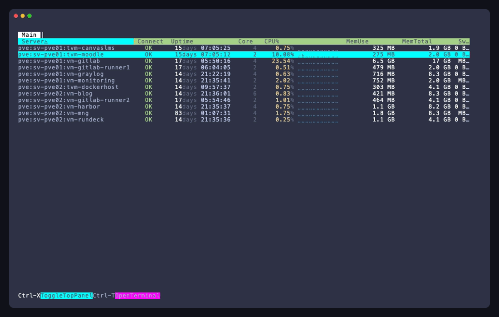
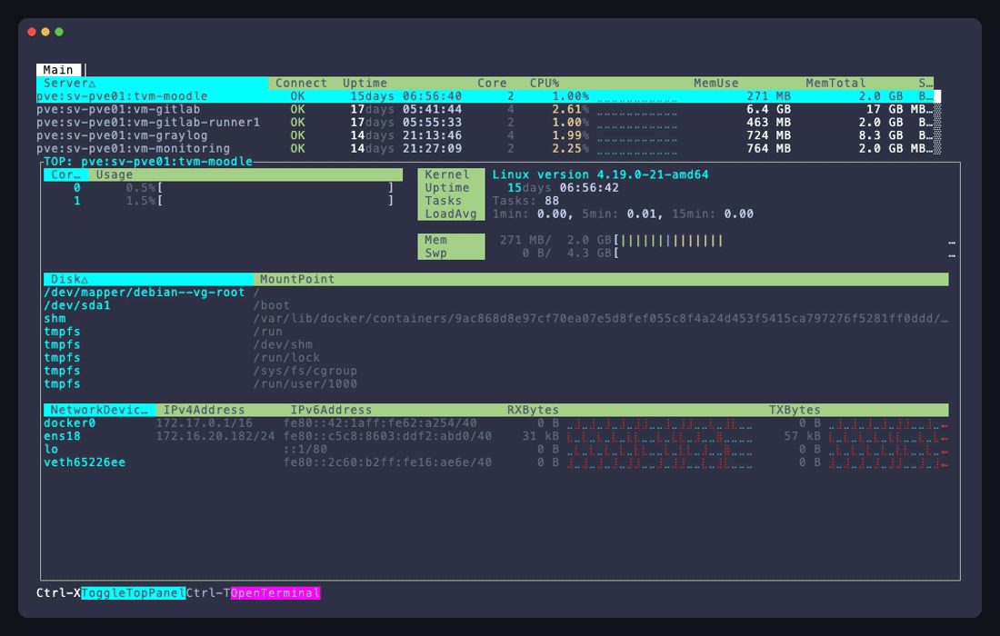

lsmon
===

<p align="center">
  
</p>

## About

`lsmon` is a TUI monitor for watching multiple remote hosts side by side.
It connects over SSH and shows system information such as CPU, memory, disk, network, and process status in one screen.
Monitoring works by periodically reading `/proc` over the SFTP protocol, so no extra commands or agents need to be installed on the target hosts.

## Usage

```shell
$ lsmon --help
NAME:
    lsmon - TUI list select and parallel ssh monitoring command.
USAGE:
    lsmon [options] [commands...]

OPTIONS:
    --host servername, -H servername    connect servername.
    --file filepath, -F filepath        config filepath. (default: "/Users/blacknon/.lssh.conf")
    --generate-lssh-conf ~/.ssh/config  print generated lssh config from OpenSSH config to stdout (~/.ssh/config by default).
    --logfile value, -L value           Set log file path.
    --share-connect, -s                 reuse the monitor SSH connection for terminals.
    --localrc                           use local bashrc shell for opened terminals.
    --not-localrc                       not use local bashrc shell for opened terminals.
    --list, -l                          print server list from config.
    --debug                             debug pprof. use port 6060.
    --help, -h                          print this help
    --enable-control-master             temporarily enable ControlMaster for this command execution
    --disable-control-master            temporarily disable ControlMaster for this command execution
    --version, -v                       print the version

COPYRIGHT:
    blacknon(blacknon@orebibou.com)

VERSION:
    lssh-suite 0.10.0 (beta/monitor)

USAGE:
    # connect parallel ssh monitoring command
  lsmon

```

## Overview

### monitor targets

<p align="center">
  
</p>

`lsmon` can monitor multiple hosts selected from the TUI list, or you can specify them directly with `-H`.
It is designed for comparing host state across a server list.
Connector-backed targets that do not advertise `sftp_transport` are excluded from the monitor target list.

```bash
# start monitoring after selecting hosts from the TUI
lsmon

# specify hosts directly
lsmon -H web01 -H web02
```

### htop like viewer

<p align="center">
  
</p>

Press `Ctrl + X` to open a top-screen-style window.
Press `Ctrl + C` to open an exit confirmation dialog.

### Open Terminal

In the htop-like viewer, press `Ctrl + T` to open a terminal for the selected host.
This lets you move directly from monitoring to interactive shell access without leaving the viewer.

By default, this terminal opens a separate SSH connection so interactive work stays isolated from the monitor.
If you want the terminal to reuse the monitor connection instead, start `lsmon` with `--share-connect` or `-s`.
You can also control localrc behavior for the opened terminal with `--localrc` or `--not-localrc`, following the same override idea as `lssh`.

### metrics

The monitor displays the following kinds of information

- uptime
- load average
- CPU usage and core count
- memory and swap usage
- disk usage and disk I/O
- network throughput and packet counts

### graph scaling

`lsmon` graph scaling can be tuned from the lssh config file with the `monitor.graph` block.
These values are optional. When omitted, `lsmon` uses built-in defaults and auto-detection where possible.

```toml
[monitor.graph]
fd_max = 16384
use_network_interface_speed = true
network_default_bytes_per_sec = 125000000
disk_default_read_bytes_per_sec = 200000000
disk_default_write_bytes_per_sec = 200000000

[monitor.graph.network_bytes_per_sec]
eth0 = 250000000

[monitor.graph.disk_read_bytes_per_sec]
nvme0n1 = 3000000000

[monitor.graph.disk_write_bytes_per_sec]
nvme0n1 = 3000000000
```

Key meanings:

- `fd_max`
  - Display scale for the `fd` graph in `System Summary`
  - This is a visual upper bound, not the kernel limit from `/proc/sys/fs/file-nr`
- `use_network_interface_speed`
  - If `true`, `lsmon` tries `/sys/class/net/<iface>/speed` first for RX/TX graph scaling
- `network_default_bytes_per_sec`
  - Fallback graph scale when interface speed is unavailable
- `network_bytes_per_sec`
  - Per-interface override, keyed by interface name such as `eth0` or `ens5`
- `disk_default_read_bytes_per_sec`, `disk_default_write_bytes_per_sec`
  - Fallback graph scale for disk throughput
- `disk_read_bytes_per_sec`, `disk_write_bytes_per_sec`
  - Per-device override, keyed by block device name such as `sda`, `vda`, or `nvme0n1`

All byte-rate keys are expressed in bytes per second.
`lsmon` converts them to the current sampling interval internally, so you do not need to multiply by the refresh interval yourself.

### logging and debug

You can write logs to a file with `-L`.
You can also enable `pprof` on `localhost:6060` with `--debug`.

```bash
# write monitor logs to a file
lsmon -L ./lsmon.log

# enable pprof for debugging
lsmon --debug
```

### notes

The default config search order is `~/.lssh.toml`, `~/.lssh.yaml`, `~/.lssh.yml`, then `~/.lssh.conf`.
If no log file is specified, logs are written to `/dev/null`.

Most data collection assumes Linux-style `/proc` information on the remote side, so in practice `lsmon` is aimed at Linux hosts.
The SSH connect timeout is set to 5 seconds in the current implementation.

### connection lifecycle

`lsmon` starts one SSH/SFTP-backed monitor connection per selected host.
If a host is unreachable at startup, the host can still remain in the list and `lsmon` will keep retrying in the background.

In the current implementation:

- `Node.Connect()` creates or replaces the SSH/SFTP transport for one host
- `Node.StartMonitoring()` keeps polling metrics from the currently active transport
- `Monitor.reconnectServer()` owns the periodic reconnect retry loop

This means the monitor loop itself does not initiate reconnects directly.
It waits for the monitor supervisor to refresh the connection and then resumes metric collection.
