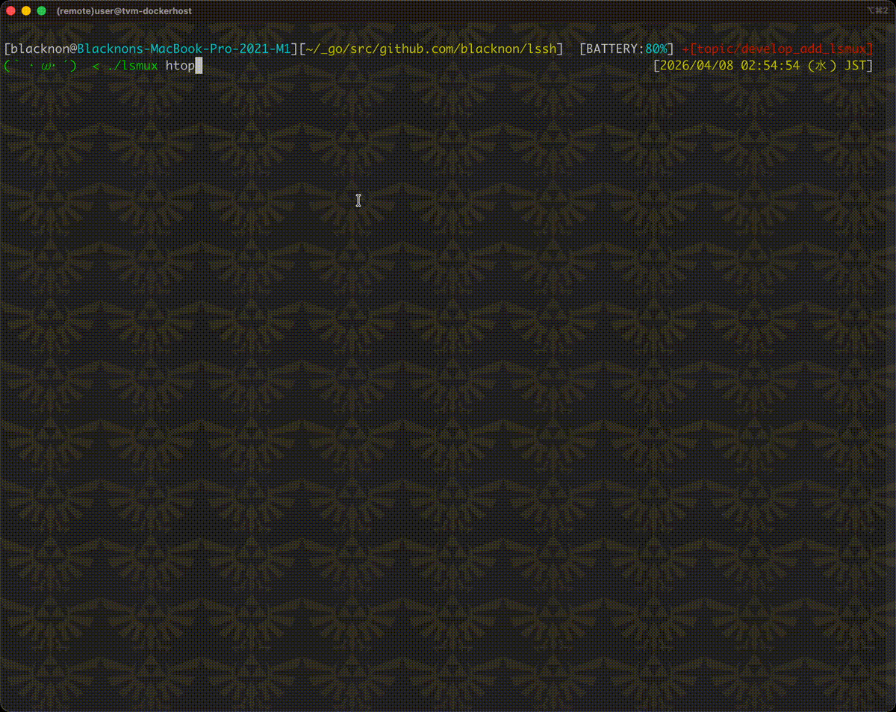
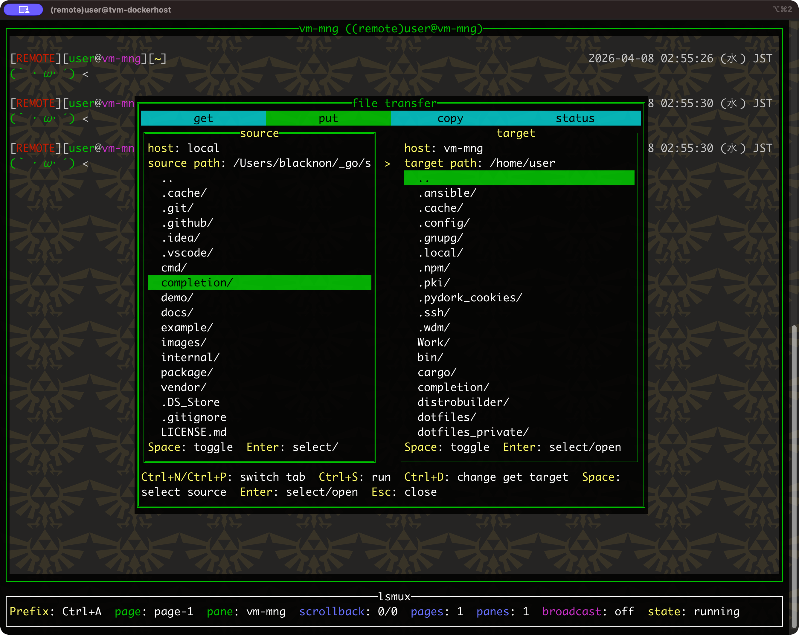

lsmux
===

<p align="center">
  
</p>


## About

`lsmux` is a pure Go, tmux-like SSH client that lets you select hosts from your `lssh` inventory and manage multiple remote sessions in a pane-based TUI. It is designed for operators who want to view several servers at once, run commands in dedicated panes, and keep the flexibility of `lssh` host selection while working in a terminal multiplexer style workflow.

Also, you can transfer files to a remote host directly from the target pane.

## Usage

```shell
$ lsmux --help
NAME:
    lsmux - TUI mux style SSH client with host selector and pane management.
USAGE:
    lsmux [options] [command...]

OPTIONS:
    --host servername, -H servername            connect servername.
    --file filepath, -F filepath                config filepath. (default: "/Users/blacknon/.lssh.conf")
    --generate-lssh-conf ~/.ssh/config          print generated lssh config from OpenSSH config to stdout (~/.ssh/config by default).
    -R [bind_address:]port:remote_address:port  Remote port forward mode.Specify a [bind_address:]port:remote_address:port. If only one port is specified, it will operate as Reverse Dynamic Forward.
    -r port                                     HTTP Reverse Dynamic port forward mode. Specify a port.
    -m port:/path/to/local                      NFS Reverse Dynamic forward mode. Specify a port:/path/to/local.
    --hold                                      keep command panes after remote command exits.
    --allow-layout-change                       allow opening new pages/panes even in command mode.
    --localrc                                   use local bashrc shell.
    --not-localrc                               not use local bashrc shell.
    --session name                              persistent mux session name.
    --socket-path path                          socket path for persistent mux session.
    --attach                                    attach to an existing persistent mux session.
    --detach                                    create or keep a persistent mux session without attaching.
    --list-sessions                             list persistent mux sessions.
    --kill-session                              kill the named persistent mux session.
    --enable-transfer                           enable file transfer UI even if disabled in config.
    --disable-transfer                          disable file transfer UI for this session.
    --list, -l                                  print server list from config.
    --help, -h                                  print this help
    --enable-control-master                     temporarily enable ControlMaster for this command execution
    --disable-control-master                    temporarily disable ControlMaster for this command execution
    --version, -v                               print the version

VERSION:
    lssh-suite 0.9.1 (beta/sysadmin)

USAGE:
    lsmux
    lsmux command...

```

## Overview

### terminal connect

`lsmux` opens interactive SSH sessions inside panes, so you can work with multiple hosts on a single screen.
Hosts can be selected from your `lssh` inventory, and each pane keeps its own terminal state while sharing the same TUI workspace.
This makes it easy to monitor several servers side by side without leaving the multiplexer interface.

### command execution

<p align="center">
  
</p>

You can start `lsmux` with a command argument to create command panes instead of interactive shells.
This is useful for running one-shot remote commands such as `hostname`, `tail`, or health-check scripts while keeping the results visible in separate panes.
If `--hold` is enabled, finished command panes remain open so you can review their output after execution.

### forwarding

`lsmux` supports SSH forwarding features in the same workflow as regular remote sessions.
You can open panes for connections that rely on reverse-side forwarding and continue working while forwarded connections stay active in the background of the selected pane.
This is helpful when you need terminal access and SSH-based network access at the same time.

The following parallel-safe forwarding options are available:

- Remote port forward (`-R`)
- Reverse dynamic forward (`-R <port>`)
- HTTP reverse dynamic forward (`-r`)
- NFS reverse dynamic forward (`-m`)

Examples:

```shell
# remote port forwarding for each selected pane
lsmux -R 10080:localhost:80

# reverse dynamic forwarding (SOCKS-like listener on each remote host)
lsmux -R 1080

# HTTP reverse dynamic forwarding on each remote host
lsmux -r 18080

# NFS reverse dynamic forwarding on each remote host
lsmux -m 2049:/path/to/local
```

### file transfer

<p align="center">
  
</p>

Files can be transferred directly to the remote host represented by the active pane.
This allows you to move scripts, configuration files, or small assets to the target server without leaving `lsmux` or opening a separate transfer tool.
It fits well with the pane-oriented workflow when you want to upload a file and then verify it immediately in the same session.

### config

`lsmux` uses the same configuration file format as `lssh`, so existing host definitions can be reused without additional setup.
Connection settings such as address, user, authentication method, and related SSH options are loaded from the configured file.
If you already manage hosts with `lssh`, you can usually start using `lsmux` with the same inventory right away.

You can customize `lsmux` key bindings and pane colors with settings under `mux` in `~/.lssh.toml` or `~/.lssh.yaml`.

```toml
[mux]
prefix = "Ctrl+A"
quit = "&"
new_page = "c"
new_pane = "s"
split_horizontal = "\""
split_vertical = "%"
next_pane = "o"
next_page = "n"
prev_page = "p"
page_list = "w"
close_pane = "x"
broadcast = "b"
transfer = "f"
detach_client = "d"
transfer_enabled = true
scrollbar = false
socket_path = "~/.cache/lssh/lsmux-<Name>.sock"
focus_border_color = "green"
focus_title_color = "green"
broadcast_border_color = "yellow"
broadcast_title_color = "yellow"
done_border_color = "gray"
done_title_color = "gray"
```

```yaml
mux:
  prefix: "Ctrl+A"
  quit: "&"
  new_page: "c"
  new_pane: "s"
  split_horizontal: "\""
  split_vertical: "%"
  next_pane: "o"
  next_page: "n"
  prev_page: "p"
  page_list: "w"
  close_pane: "x"
  broadcast: "b"
  transfer: "f"
  detach_client: "d"
  transfer_enabled: true
  scrollbar: false
  socket_path: "~/.cache/lssh/lsmux-<Name>.sock"
  focus_border_color: "green"
  focus_title_color: "green"
  broadcast_border_color: "yellow"
  broadcast_title_color: "yellow"
  done_border_color: "gray"
  done_title_color: "gray"
```

Available `mux` settings:

- `prefix`: prefix key used before `lsmux` subcommands. Default: `Ctrl+A`
- `quit`: quit `lsmux`. Default: `&`
- `new_page`: create a new page. Default: `c`
- `new_pane`: open a host selector and add a pane. Default: `s`
- `split_horizontal`: split the current pane horizontally. Default: `"`
- `split_vertical`: split the current pane vertically. Default: `%`
- `next_pane`: move focus to the next pane. Default: `o`
- `next_page`: switch to the next page. Default: `n`
- `prev_page`: switch to the previous page. Default: `p`
- `page_list`: show the page list. Default: `w`
- `close_pane`: close the current pane. Default: `x`
- `broadcast`: toggle broadcast input to all panes on the page. Default: `b`
- `transfer`: open file transfer for the active pane. Default: `f`
- `detach_client`: key used after the prefix to detach an attached persistent client. Default: `d`
- `transfer_enabled`: allow the transfer UI in `lsmux`. Default: `true`
- `scrollbar`: show the built-in `tvxterm` scrollbar in each pane. Default: `false`
- `socket_path`: unix socket path template for persistent sessions. `<Name>` is replaced with the session name.
- `focus_border_color`, `focus_title_color`: colors for the focused pane. Default: `green`
- `broadcast_border_color`, `broadcast_title_color`: colors for panes in broadcast mode. Default: `yellow`
- `done_border_color`, `done_title_color`: colors for completed command panes. Default: `gray`

These values only control the `lsmux` UI. Host connection settings such as `addr`, `user`, `key`, and proxy options continue to be defined in the regular `common` and `server.<name>` sections.

If you use `lsmux` mainly as a bastion or observation workspace, set `transfer_enabled = false` or pass `--disable-transfer` so the file-transfer wizard cannot be opened during that session.

### persistent sessions

`lsmux` can keep a session alive in the background and let another terminal attach later.
This persistent session feature is currently not supported on Windows.

```shell
# create and attach
lsmux --session ops

# create in background only
lsmux --session ops --detach

# attach later
lsmux --attach --session ops

# list sessions
lsmux --list-sessions

# kill a session
lsmux --kill-session --session ops
```

Notes:

- persistent sessions currently use a local socket and are supported on Unix-like systems
- Windows keeps the normal foreground `lsmux` workflow, but attach/detach is not supported yet because a ConPTY-based backend is still needed
- when attached, the default detach key is `Ctrl+A d`; this follows `mux.prefix` + `mux.detach_client`
