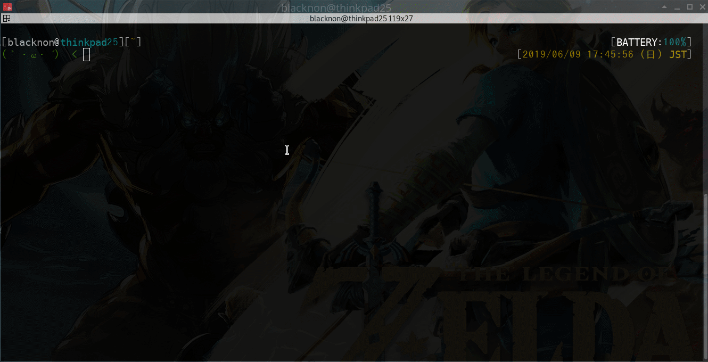
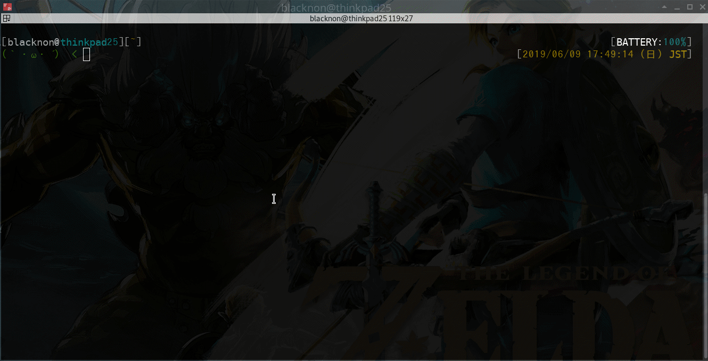
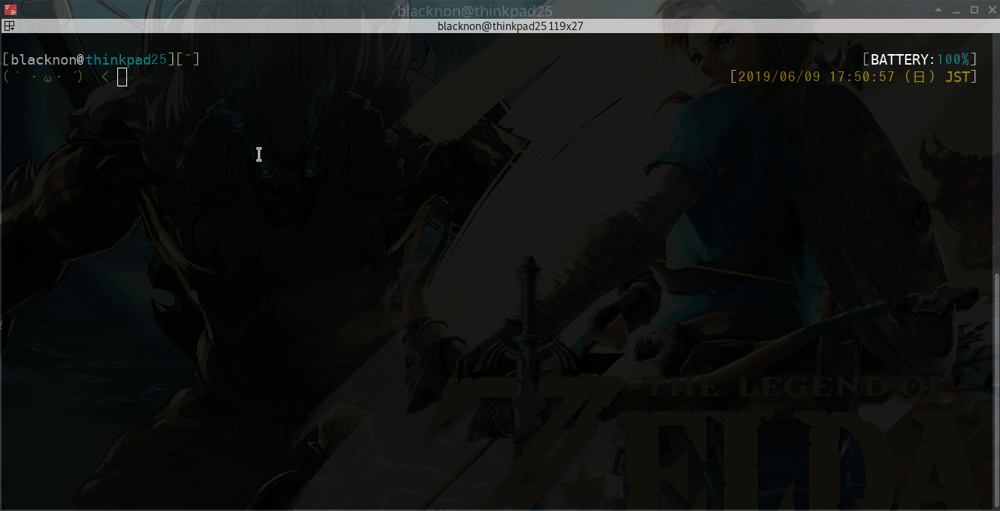
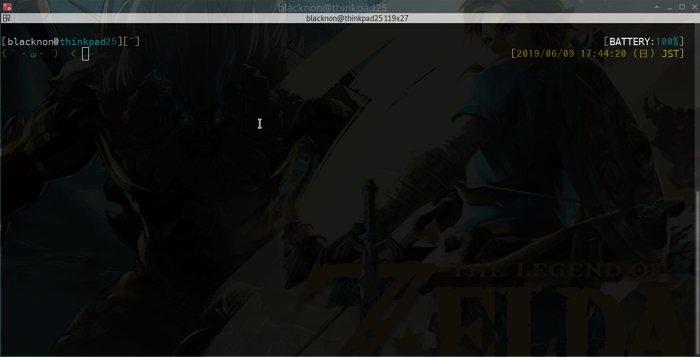
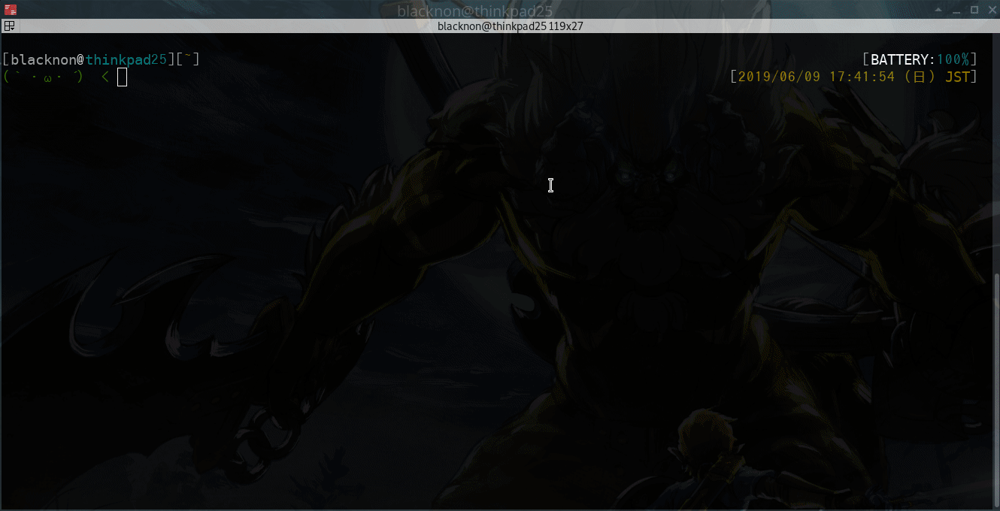

lssh
===

## About

`lssh` is a TUI-based SSH client that lets you select hosts from a predefined configuration and connect to them interactively.
It also supports running commands in parallel across multiple hosts, port forwarding, X11 forwarding, and proxy-based connections.

## Usage

```shell
$ lssh --help
NAME:
    lssh - TUI list select and parallel ssh client command.
USAGE:
    lssh [options] [commands...]

OPTIONS:
    --host servername, -H servername            connect servername.
    --file filepath, -F filepath                config filepath. (default: "/Users/blacknon/.lssh.conf")
    -L [bind_address:]port:remote_address:port  Local port forward mode.Specify a [bind_address:]port:remote_address:port. Only single connection works.
    -R [bind_address:]port:remote_address:port  Remote port forward mode.Specify a [bind_address:]port:remote_address:port. If only one port is specified, it will operate as Reverse Dynamic Forward. Only single connection works.
    -D port                                     Dynamic port forward mode(Socks5). Specify a port. Only single connection works.
    -d port                                     HTTP Dynamic port forward mode. Specify a port. Only single connection works.
    -r port                                     HTTP Reverse Dynamic port forward mode. Specify a port. Only single connection works.
    -M port:/path/to/remote                     NFS Dynamic forward mode. Specify a port:/path/to/remote. Only single connection works.
    -m port:/path/to/local                      NFS Reverse Dynamic forward mode. Specify a port:/path/to/local. Only single connection works.
    --tunnel ${local}:${remote}                 Enable tunnel device. Specify ${local}:${remote} (use 'any' to request next available).
    -w                                          Displays the server header when in command execution mode.
    -W                                          Not displays the server header when in command execution mode.
    --not-execute, -N                           not execute remote command and shell.
    --X11, -X                                   Enable x11 forwarding(forward to ${DISPLAY}).
    -Y                                          Enable trusted x11 forwarding(forward to ${DISPLAY}).
    --term, -t                                  run specified command at terminal.
    --parallel, -p                              run command parallel node(tail -F etc...).
    -P                                          run shell or command in mux UI (lsmux compatible).
    --hold                                      keep command panes after remote command exits (with -P).
    --allow-layout-change                       allow opening new pages/panes even in command mode (with -P).
    --localrc                                   use local bashrc shell.
    --not-localrc                               not use local bashrc shell.
    --list, -l                                  print server list from config.
    --help, -h                                  print this help
    -f                                          Run in background after forwarding/connection (ssh -f like).
    --version, -v                               print the version

COPYRIGHT:
    blacknon(blacknon@orebibou.com)

VERSION:
    lssh-suite 0.8.0 (stable/core)

USAGE:
    # connect ssh
    lssh

    # run command selected server over ssh.
    lssh command...

    # run command parallel in selected server over ssh.
    lssh -p command...

    # run command or shell in mux UI.
    lssh -P [command...]

```

## OverView

### connect Terminal

Terminal connections work as naturally as with the standard `ssh` command, so you can move from familiar interactive sessions to `lssh` without changing how you work.
Unlike many tools in this space, full-screen applications such as `vim` and `htop` generally work as expected, and shell prompts stay intact without the display glitches that often disrupt interactive sessions.

### command execution

<p align="center">
  
  
  
</p>

You can also create a block for command execution and pass a command as an argument, just like the OpenSSH client.
This is useful when you want to run a single remote command without starting an interactive shell.

For example, the following runs `hostname` on the selected host.

```sh
lssh hostname
```

If you add the `-p` option, the same command is executed in parallel on the selected hosts.

```sh
lssh -p hostname
```

If you pipe input before the command, `stdin` is sent to the selected server.

```sh
echo "hostname" | lssh cat
```

If you want the `lsmux` style pane UI from `lssh`, use `-P`.
When a command is given, piped `stdin` is copied to each pane, and `--hold` keeps finished panes open.

```sh
lssh -P --hold hostname
```

### terminal log

You can record terminal session logs while connected to a host.
If needed, timestamps can also be included in the log output, which is useful when reviewing command history or troubleshooting interactive work later.


### pre_cmd / post_cmd

<p align="center">

</p>

You can run local commands before connecting with `pre_cmd` and after disconnecting with `post_cmd`.
These options are useful for changing the local terminal state only while the SSH session is active.

For example, if your terminal supports OSC escape sequences, you can switch the terminal theme or colors when connecting to a host and restore them after disconnecting.

`~/.lssh.conf` example.

```toml
[server.theme]
addr = "192.168.100.10"
user = "demo"
pre_cmd = 'printf "\033]50;SetProfile=Remote\a"'    # switch terminal theme on connect. it used iTerm2.
post_cmd = 'printf "\033]50;SetProfile=Default\a"'  # restore terminal theme on disconnect. it used iTerm2.

[server.color]
addr = "192.168.100.11"
user = "demo"
pre_cmd = 'printf "\e]10;#ffffff\a\e]11;#503000\a"'  # change foreground/background colors
post_cmd = 'printf "\e]10;#ffffff\a\e]11;#000000\a"' # restore local colors
```

### ssh-agent

`lssh` supports `ssh-agent`, so you can use keys already loaded into your agent without specifying a private key file for each host.

`~/.lssh.conf` example.

```toml
[server.agent]
addr = "192.168.100.20"
user = "demo"
ssh_agent = true
note = "use keys from ssh-agent"
```

### forwarding

The following forwarding features are available

- Local port forward (`-L`)
- Remote port forward (`-R`)
- Dynamic forward / SOCKS5 (`-D`)
- HTTP Dynamic forward (`-d`)
- HTTP Reverse Dynamic forward (`-r`)
- NFS Dynamic forward (`-M`)
- NFS Reverse Dynamic forward (`-m`)
- Tunnel device (`--tunnel`)
- x11 forward (`-X`, `-Y`)

When using NFS forward, lssh starts the NFS server and begins listening on the specified port.
After that, the forwarded PATH can be used as a mount point on the local machine or the remote machine.

#### if use command line option

Command line examples.

```bash
# local port forwarding
lssh -L 8080:localhost:80

# local unix socket forwarding
lssh -L /tmp/local.sock:/tmp/remote.sock

# remote port forwarding
lssh -R 80:localhost:8080

# dynamic port forwarding (SOCKS5)
lssh -D 10080

# HTTP dynamic port forwarding
lssh -d 18080

# HTTP reverse dynamic port forwarding
lssh -r 18080

# NFS dynamic forward
# Note: required mount process after forward.
lssh -M 2049:/path/to/remote

# NFS reverse dynamic forward
# Note: required mount process after forward.
lssh -m 2049:/path/to/local

# tunnel device
lssh --tunnel 0:0

# tunnel device (request next available device numbers)
lssh --tunnel any:any

# x11 forwarding
lssh -X

# trusted x11 forwarding
lssh -Y
```

#### if use config file

`~/.lssh.conf` examples.

```toml
# local port forwarding
[server.forward-local]
port_forward = "local"
port_forward_local = "8080"
port_forward_remote = "localhost:80"

# remote port forwarding
[server.forward-remote]
port_forward = "remote"
port_forward_local = "80"
port_forward_remote = "localhost:8080"

# multiple port forwardings
[server.forwards]
port_forwards = [
    "L:8080:localhost:80",
    "R:80:localhost:8080",
]

# dynamic port forwarding (SOCKS5)
[server.dynamic]
dynamic_port_forward = "10080"

# HTTP dynamic port forwarding
[server.http-dynamic]
http_dynamic_port_forward = "18080"

# HTTP reverse dynamic port forwarding
[server.http-reverse-dynamic]
http_reverse_dynamic_port_forward = "18080"

# NFS dynamic forward
[server.nfs-dynamic]
nfs_dynamic_forward = "2049"
nfs_dynamic_forward_path = "/path/to/remote"

# NFS reverse dynamic forward
[server.nfs-reverse-dynamic]
nfs_reverse_dynamic_forward = "2049"
nfs_reverse_dynamic_forward_path = "/path/to/local"

# x11 forwarding
[server.x11]
x11 = true

# trusted x11 forwarding
[server.x11-trusted]
x11_trusted = true
```

Tunnel device forwarding is available from the command line with `--tunnel`.


### local bashrc

You can connect using a local bashrc file (if the ssh login shell is bash), without leaving cache or other temporary files behind on the target server.

<p align="center">

</p>

If you need to transfer a large bashrc, you can enable compression during transfer by setting `local_rc_compress = true`.

`~/.lssh.conf` example.

```toml
[server.localrc]
addr = "192.168.100.104"
key  = "/path/to/private_key"
note = "Use local bashrc files."
local_rc = 'yes'
local_rc_compress = true # gzip compress localrc file data
local_rc_file = [
     "~/dotfiles/.bashrc"
    ,"~/dotfiles/bash_prompt"
    ,"~/dotfiles/sh_alias"
    ,"~/dotfiles/sh_export"
    ,"~/dotfiles/sh_function"
]
```

#### Tips

##### Use local vimrc & tmux.conf

When you want to use your local `vimrc` or `tmux.conf` on the remote side without leaving files behind, the practical approach is to generate wrapper functions and transfer those wrappers with `local_rc_file`. Unlike `bash --rcfile`, these tools need the config every time they start, so it is easier to decode the local config inside a function such as `lvim` or `ltmux` and then replace the command with an alias like `alias vim=lvim`.

This is the same approach used in `blacknon/dotfiles` with `update_lvim` and `update_ltmux`: keep the editable source files locally, then regenerate small shell functions that embed the latest config as `base64`.

For example:

```bash
# editable local files
~/dotfiles/.vimrc
~/dotfiles/.tmux.conf

# generated wrapper files
~/dotfiles/sh/functions/lvim.sh
~/dotfiles/sh/functions/ltmux.sh
```

```bash
update_lvim
update_ltmux
```

`lvim.sh` can define a wrapper like this:

```bash
function lvim() {
    \vim -u <(printf '%s' 'BASE64_ENCODED_VIMRC' | base64 -d | gzip -dc) "$@"
}
alias vim=lvim
```

`ltmux.sh` can do the same for `tmux`, and can also append a generated `default-command` so that shells started inside tmux reuse the same local rc bundle.

The demo environment under [demo/README.md](../../demo/README.md) includes a working example with:

- `~/.demo_localrc/vimrc`
- `~/.demo_localrc/tmux.conf`
- `~/.demo_localrc/bin/update_lvim`
- `~/.demo_localrc/bin/update_ltmux`
- `~/.demo_localrc/generated/lvim.sh`
- `~/.demo_localrc/generated/ltmux.sh`

##### If you want peco or fzf on remote machine

If the remote machine does not have a fuzzy finder such as [peco](https://github.com/peco/peco) or [fzf](https://github.com/junegunn/fzf), but you still want to use that kind of workflow there, try [boco](https://github.com/blacknon/boco).

Because boco is implemented as a shell function, you can bring it to the remote machine as-is through `local_rc`.

Also, you can use `NFS reverse mounting (-m)` to transfer Linux binaries to a remote machine.
Using this method, it should be possible to use peco or fzf even if they are not installed on the remote machine.

We recommend forwarding the following function:

```bash
reverse_mount() {
  usage() {
    echo "Usage: reverse_mount [-p port] [-s] mount_path"
    return 1
  }

  local is_sudo
  local port=2049
  local path

  local opt
  while getopts "p:s" opt; do
    case $opt in
    p) port="${OPTARG}" ;;
    s) is_sudo="1" ;;
    esac
  done
  shift $((OPTIND - 1))

  if [ $# -eq 0 ]; then
    echo "Error: Arguments are required."
    usage
  fi

  path="$(readlink -f $1)"

  local mount_cmd="mount -t nfs -o vers=3,proto=tcp,port=${port},mountport=${port} 127.0.0.1:/ ${path}"
  local umount_cmd="umount ${path}"
  if [ "${is_sudo}" -eq "1" ]; then
    mount_cmd="sudo sh -c '${mount_cmd}'"
    umount_cmd="sudo sh -c '${umount_cmd}'"
  fi

  eval ${mount_cmd}

  trap "cd; echo 'umount reverse mount dir';${umount_cmd}" EXIT
}
```

##### If you use iTerm2 and image view in terminal

If you use iTerm2 and display images in the terminal with the [Inline image Protocol](https://iterm2.com/documentation-images.html), it is useful to use [this function](https://iterm2.com/documentation-images.html).

Because this is not a script, you can bring it to a remote machine as-is.

##### Using lssh as an SSH bastion host

You can use `lssh` on a jump host and connect to final destinations from there.

For example, install `lssh` on the bastion server, prepare a host list that is shared by your team, and then start `lssh` after logging in to the bastion host. This is useful when direct access to target servers is restricted and all SSH access must go through a single entry point.

workflow:

1. SSH to the bastion host.
2. Start `lssh` on the bastion host.
3. Select the destination server from the `lssh` list.
4. Connect to the selected server from the bastion host.

This approach helps centralize access paths while keeping the server selection flow simple for operators.
