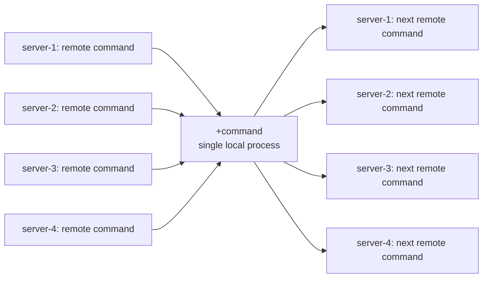
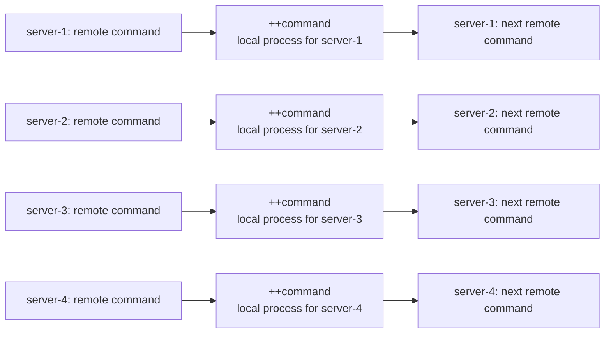

lsshell
===

<p align="center">
  
</p>


## About

`lsshell` is a parallel interactive shell for sending commands to multiple hosts at once.
It can broadcast the same command to all selected hosts, target specific hosts, and run local helper commands from the same prompt.

## Usage

```shell
$ lsshell --help
NAME:
    lsshell - TUI list select and parallel ssh client shell.
USAGE:
    lsshell [options] [commands...]

OPTIONS:
    --host servername, -H servername            connect servername.
    --file filepath, -F filepath                config filepath. (default: "/Users/blacknon/.lssh.conf")
    -R [bind_address:]port:remote_address:port  Remote port forward mode.Specify a [bind_address:]port:remote_address:port. If only one port is specified, it will operate as Reverse Dynamic Forward. Only single connection works.
    -r port                                     HTTP Reverse Dynamic port forward mode. Specify a port. Only single connection works.
    -m port:/path/to/local                      NFS Reverse Dynamic forward mode. Specify a port:/path/to/local. Only single connection works.
    --term, -t                                  run specified command at terminal.
    --list, -l                                  print server list from config.
    --help, -h                                  print this help
    --version, -v                               print the version

COPYRIGHT:
    blacknon(blacknon@orebibou.com)

VERSION:
    lssh-suite 0.8.0 (beta/sysadmin)

USAGE:
    # connect parallel ssh shell
  lsshell

```

## OverView

### shell config

You can customize prompt display and other interactive shell behavior with settings under `shell` in the config file.

### config example

`~/.lssh.conf` example.

```toml
[shell]
PROMPT = "[${COUNT}] <<< "
OPROMPT = "[${SERVER}][${COUNT}] > "
title = "lsshell"
histfile = "~/.lssh_history"
pre_cmd = "printf 'start lsshell\n'"
post_cmd = "printf 'finish lsshell\n'"
```

### interactive shell

Start `lsshell`, select one or more hosts, and then send commands to all selected hosts from a single prompt.
You can also specify hosts directly with `-H`.

```bash
# start parallel shell after selecting hosts from the TUI
lsshell

# specify hosts directly
lsshell -H web01 -H web02
```

Because `lsshell` runs an internal shell, you can combine remote commands with local commands through pipes and process substitution. Use `+` to run a local command inside the shell, and use `<()` or `+<()` when you want to feed remote output into a local tool such as `vimdiff`.

```bash
# send remote output to a local command
cat /etc/hosts | +sort | +uniq

# compare the same remote file from two hosts with local vimdiff
+vimdiff +<(cat /etc/hosts)
```

### pipeline

The pipeline behavior differs between `+command` and `++command`.

#### if use +command

```bash
remote-command | +command | remote-command
```

```shell
[0] <<< hostname | +cat | cat
[Command: hostname |+cat |cat  ]
[server-1][0] >  server-2
[server-2][0] >  server-2
[server-3][0] >  server-2
[server-3][0] >  server-3
[server-1][0] >  server-3
[server-2][0] >  server-3
[server-3][0] >  server-1
[server-2][0] >  server-1
[server-1][0] >  server-1

```



#### if use ++command

```bash
remote-command | ++command | remote-command
```

```shell
[0] <<< hostname | ++cat | cat
[Command: hostname |++cat |cat  ]
[server-1][0] >  server-1
[server-2][0] >  server-2
[server-3][0] >  server-3
```



### command routing

You can broadcast commands to all selected hosts, limit a command to specific hosts, or run a local command.

```bash
# run on all selected hosts
uname -a

# run only on specific hosts
@web01:hostname
@web01,web02:systemctl status sshd

# run a local command
+grep ERROR ./local.log
```

### built-in commands

`lsshell` also provides built-in helper commands.

```text
exit, quit    exit the shell
clear         clear the screen
%history      show command history
%out          show output for a history entry
%outlist      show stored output entries
%outexec      run a local command with history output in environment variables
%get          copy from remote to local
%put          copy from local to remote
%sync         one-way sync between local and remote paths
```

`%sync` uses the same path prefixes as `lssync`, for example `local:./site` or `remote:/srv/app`.
When you need to pin a remote path to a specific host, use `remote:@host:/path`.

### forwarding

The following forwarding options are available

- Remote port forward (`-R`)
- HTTP Reverse Dynamic forward (`-r`)
- NFS Reverse Dynamic forward (`-m`)

Command line examples.

```bash
# remote port forwarding
lsshell -R 80:localhost:8080

# HTTP reverse dynamic forwarding
lsshell -r 18080

# NFS reverse dynamic forwarding
lsshell -m 2049:/path/to/local
```

### history and notes

The command history file is stored in `~/.lssh_history` by default.
Completion supports remote commands, local commands, paths, and built-in commands.

The default config file path is `~/.lssh.conf`.
