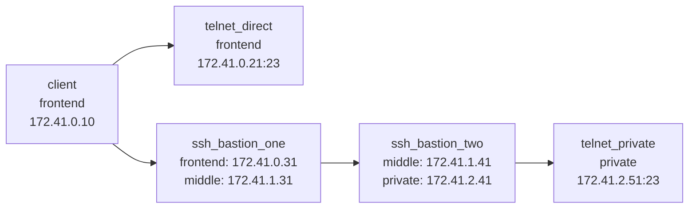

demo-telnet-provider
====================

`demo-telnet-provider/` is a separate Docker Compose demo focused on the `provider-connector-telnet` flow.

Topology
--------

- `client`
  - runs `lssh` plus the `provider-connector-telnet` binary
- `ssh_bastion_one`
  - first SSH hop on the frontend network
- `ssh_bastion_two`
  - second SSH hop behind `ssh_bastion_one`
- `telnet_direct`
  - telnet target reachable directly from `client`
- `telnet_private`
  - telnet target reachable only through `ssh_bastion_one -> ssh_bastion_two`

This gives the requested four remote hosts:

- SSH bastion 1
- SSH bastion 2
- direct telnet host
- telnet host behind the SSH chain

Network Layout
--------------



- `frontend`
  - `client`
  - `telnet_direct`
  - `ssh_bastion_one`
- `middle`
  - `ssh_bastion_one`
  - `ssh_bastion_two`
- `private`
  - `ssh_bastion_two`
  - `telnet_private`

`telnet_direct` is directly reachable from `client` on `frontend`.
`telnet_private` belongs only to `private`, so it can be reached only after hopping through `ssh_bastion_one` and `ssh_bastion_two`.

Usage
-----

```bash
cd demo-telnet-provider
docker compose up -d --build
docker compose exec --user demo client bash
```

Or from the repository root with `mise`:

```bash
mise run demo_telnet_provider_up
mise run demo_telnet_provider_client
```

Inside the client container:

```bash
lssh -H
lssh TelnetDirect
lssh TelnetViaDoubleSSH
```

The demo config lives at `/home/demo/.lssh.conf`.

Expected host names after login:

- `TelnetDirect` -> `telnet-direct`
- `TelnetViaDoubleSSH` -> `telnet-private`

Notes
-----

- `TelnetViaDoubleSSH` exercises the new provider-managed telnet bridge that uses the core-side proxy chain only as an abstract dialer.
- The SSH bastions use the same demo keypair as the existing SSH demo.
- Demo credentials are fixed and must not be reused outside local testing.
- Stop the environment with `docker compose down -v` or `mise run demo_telnet_provider_down`.
