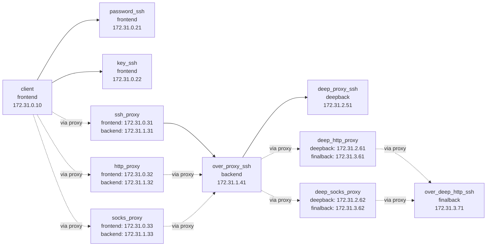

Demo
===

`demo/` provides a Docker Compose environment for trying the main `lssh` connection patterns locally in one place.
From the client container, you can use `lssh` / `lscp` / `lsftp` / `lsshell` / `lsmon` to verify the following:

- Using the demo client itself as an SSH bastion that launches `lssh`
- Password-based SSH authentication
- Private key-based SSH authentication
- Multi-hop connections through an SSH proxy
- Nested SSH proxy chains through an intermediate private host
- HTTP and SOCKS5 proxy hops that sit behind an SSH-only intermediate host
- Connections through an HTTP proxy
- Connections through a SOCKS5 proxy
- Loading local settings with `local_rc`
- Wrapping remote `vim` / `tmux` with local config generated by `update_lvim` / `update_ltmux`

## Structure

This Compose setup uses four Docker networks.



- `frontend`
  - `client`
  - `password_ssh`
  - `key_ssh`
  - `ssh_proxy`
  - `http_proxy`
  - `socks_proxy`
- `backend`
  - `ssh_proxy`
  - `http_proxy`
  - `socks_proxy`
  - `over_proxy_ssh`
- `deepback`
  - `over_proxy_ssh`
  - `deep_proxy_ssh`
  - `deep_http_proxy`
  - `deep_socks_proxy`
- `finalback`
  - `deep_http_proxy`
  - `deep_socks_proxy`
  - `over_deep_http_ssh`

`over_proxy_ssh` belongs only to `backend`, so it is not directly reachable from `client`.
To connect to it, you must go through `ssh_proxy`, `http_proxy`, or `socks_proxy`.
`deep_proxy_ssh` belongs only to `deepback`, so it is reachable only through `over_proxy_ssh`.
`over_deep_http_ssh` belongs only to `finalback`, so it is reachable only after `OverSshProxy` and then either `deep_http_proxy` or `deep_socks_proxy`.

## Start

```sh
cd demo
docker compose up --build -d
docker compose exec --user demo client bash
```

The `client` container also opens SSH on host port `2222`.
Its `~/.ssh/authorized_keys` is generated with a forced `command="/usr/local/bin/demo-lssh-bastion.sh"` entry, so logging in with the demo key starts `lssh` instead of a normal shell.

From the host, you can try:

```sh
# open the interactive lssh bastion session
ssh -t -p 2222 -i demo/client/home/.ssh/demo_lssh_ed25519 demo@127.0.0.1

# run a non-interactive check through the same forced command
ssh -p 2222 -i demo/client/home/.ssh/demo_lssh_ed25519 demo@127.0.0.1 -- --list
```

After entering the client container, the demo configuration is available at `/home/demo/.lssh.conf`.
This configuration also serves as an example of the include feature, and the actual settings are split across `~/.lssh.d/*.toml`.

```toml
[includes]
path = [
    "~/.lssh.d/servers_proxy.toml",
    "~/.lssh.d/servers_direct.toml"
]
```

The split files are:

- `~/.lssh.d/servers_direct.toml`
  - `PasswordAuth`
  - `KeyAuth`
  - `LocalRcKeyAuth`
- `~/.lssh.d/servers_proxy.toml`
  - `ssh_proxy`
  - `OverSshProxy`
  - `OverHttpProxy`
  - `OverSocksProxy`
  - `OverNestedSshProxy`
  - `OverNestedHttpProxy`
  - `OverNestedSocksProxy`

`~/.lssh.conf` also defines shared settings in `[common]` and the proxy entries `http_proxy`, `socks_proxy`, `deep_http_proxy`, and `deep_socks_proxy`.

## Demo Targets

`~/.lssh.conf` defines the following targets:

- `PasswordAuth`
  - Password-authenticated server
- `KeyAuth`
  - Private key-authenticated server
- `OverSshProxy`
  - Private server reached through an SSH proxy
- `OverHttpProxy`
  - Private server reached through an HTTP proxy
- `OverSocksProxy`
  - Private server reached through a SOCKS5 proxy
- `OverNestedSshProxy`
  - Private server reached through `OverSshProxy` as a second SSH hop
- `OverNestedHttpProxy`
  - Private server reached through `OverSshProxy` and then an HTTP proxy
- `OverNestedSocksProxy`
  - Private server reached through `OverSshProxy` and then a SOCKS5 proxy
- `LocalRcKeyAuth`
  - Private key-authenticated server with `local_rc = "yes"` enabled

## Try It

Inside the client container, you can try commands like these:

```sh
# List configured targets
lssh --list

# Password authentication
lssh --host PasswordAuth

# Private key authentication
lssh --host KeyAuth

# Connect to the private server through an SSH proxy
lssh --host OverSshProxy

# Connect to the private server through an HTTP proxy
lssh --host OverHttpProxy

# Connect to the private server through a SOCKS5 proxy
lssh --host OverSocksProxy

# Connect to the deeper private server through OverSshProxy
lssh --host OverNestedSshProxy

# Connect to the final private server through OverSshProxy and a deep HTTP proxy
lssh --host OverNestedHttpProxy

# Connect to the final private server through OverSshProxy and a deep SOCKS5 proxy
lssh --host OverNestedSocksProxy

# Connect with local_rc applied
lssh --host LocalRcKeyAuth
```

From the host, you can also treat `client` as a jump entrypoint that always launches `lssh`:

```sh
# choose from the configured hosts over SSH
ssh -t -p 2222 -i demo/client/home/.ssh/demo_lssh_ed25519 demo@127.0.0.1

# or forward arguments to the forced lssh command
ssh -p 2222 -i demo/client/home/.ssh/demo_lssh_ed25519 demo@127.0.0.1 -- --host OverNestedSshProxy hostname

# or reach the final host through OverSshProxy and deep_http_proxy
ssh -p 2222 -i demo/client/home/.ssh/demo_lssh_ed25519 demo@127.0.0.1 -- --host OverNestedHttpProxy hostname
```

The nested SSH and nested HTTP examples are defined like this:

```toml
[server.OverSshProxy]
addr = "172.31.1.41"
key = "~/.ssh/demo_lssh_ed25519"
proxy = "ssh_proxy"

[server.OverNestedSshProxy]
addr = "172.31.2.51"
key = "~/.ssh/demo_lssh_ed25519"
proxy = "OverSshProxy"

[proxy.deep_http_proxy]
addr = "172.31.2.61"
port = "8888"
proxy = "OverSshProxy"

[server.OverNestedHttpProxy]
addr = "172.31.3.71"
key = "~/.ssh/demo_lssh_ed25519"
proxy = "deep_http_proxy"
proxy_type = "http"
```

`LocalRcKeyAuth` is configured to transfer the following local files:

- `~/.demo_localrc/bash_prompt`
- `~/.demo_localrc/sh_alias`
- `~/.demo_localrc/sh_export`
- `~/.demo_localrc/sh_function`
- `~/.demo_localrc/generated/lvim.sh`
- `~/.demo_localrc/generated/ltmux.sh`

The generated wrappers come from these editable local files:

- `~/.demo_localrc/vimrc`
- `~/.demo_localrc/tmux.conf`
- `~/.demo_localrc/bin/update_lvim`
- `~/.demo_localrc/bin/update_ltmux`

After connecting, run `echo $LSSH_LOCAL_RC`, `demo_whoami`, or `demo_localrc_status` to confirm that `local_rc` has been applied.

## Local Rc Demo

`LocalRcKeyAuth` demonstrates the same pattern used in `blacknon/dotfiles`: keep the shell pieces in `local_rc_file`, then generate small wrapper functions that decode local `vimrc` / `tmux.conf` on demand.

Inside the client container:

```sh
# inspect the editable local files
ls -1 ~/.demo_localrc

# regenerate the shipped wrapper functions after editing vimrc / tmux.conf
update_lvim
update_ltmux

# or run both together
demo-refresh-localrc
```

After connecting with `lssh --host LocalRcKeyAuth`, you can confirm that the wrappers are active:

```sh
# local_rc flag and generated functions
demo_localrc_status

# vim should show the demo statusline from ~/.demo_localrc/vimrc
vim "+set nomore" "+set statusline?" "+q"

# tmux should read ~/.demo_localrc/tmux.conf through ltmux
tmux start-server \; show -gv status-left \; show-environment -g LSSH_DEMO_TMUX_CONF \; kill-server
```

Expected results:

- `demo_localrc_status` reports `lvim: ready` and `ltmux: ready`
- `vim` prints `statusline=[demo-localrc] %f`
- `tmux` prints `[demo-localrc] ` and `LSSH_DEMO_TMUX_CONF=enabled`

If you edit `~/.demo_localrc/vimrc` or `~/.demo_localrc/tmux.conf`, run `update_lvim` and `update_ltmux` again before reconnecting so the generated wrapper files are refreshed.

## Direct Reachability Check

`client` is expected to be unable to reach `over_proxy_ssh` directly.
You can confirm this by running the following inside the client container:

```sh
nc -zv 172.31.1.41 22
nc -zv 172.31.2.51 22
nc -zv 172.31.3.71 22
```

Direct access should fail, while proxy-based connections such as `lssh --host OverSshProxy`, `lssh --host OverNestedSshProxy`, `lssh --host OverNestedHttpProxy`, and `lssh --host OverNestedSocksProxy` should succeed.

## Notes

- Demo keys and passwords are included under `demo/` with fixed values. Do not use them in production.
- The client container also includes the OpenSSH client, so you can compare behavior with the `ssh` command.
- Stop the demo environment with `docker compose down -v`.
