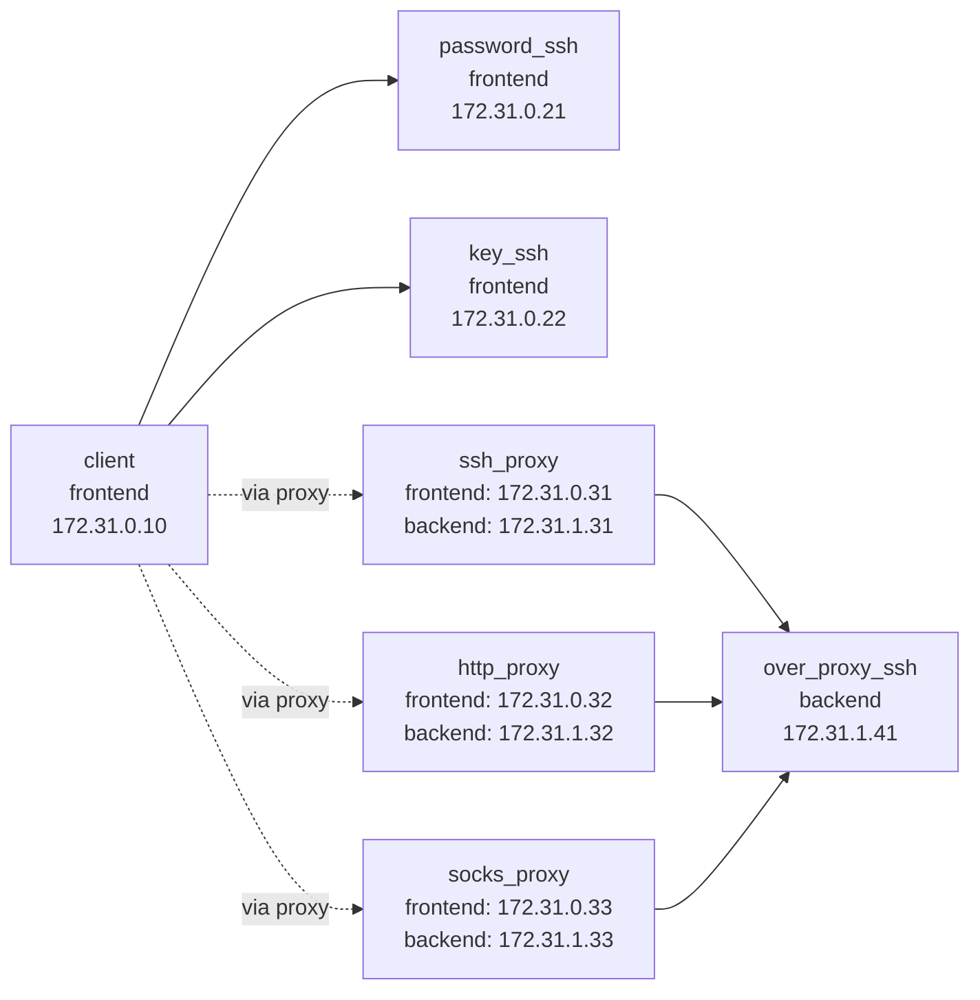

Demo
===

`demo/` provides a Docker Compose environment for trying the main `lssh` connection patterns locally in one place.
From the client container, you can use `lssh` / `lscp` / `lsftp` / `lsshell` / `lsmon` to verify the following:

- Password-based SSH authentication
- Private key-based SSH authentication
- Multi-hop connections through an SSH proxy
- Connections through an HTTP proxy
- Connections through a SOCKS5 proxy
- Loading local settings with `local_rc`

## Structure

This Compose setup uses two Docker networks.



- `frontend`
  - `client`
  - `password_ssh`
  - `key_ssh`
  - `ssh_proxy`
  - `http_proxy`
  - `socks_proxy`
- `backend`
  - `ssh_proxy`
  - `http_proxy`
  - `socks_proxy`
  - `over_proxy_ssh`

`over_proxy_ssh` belongs only to `backend`, so it is not directly reachable from `client`.
To connect to it, you must go through `ssh_proxy`, `http_proxy`, or `socks_proxy`.

## Start

```sh
cd demo
docker compose up --build -d
docker compose exec client bash
```

After entering the client container, the demo configuration is available at `/home/demo/.lssh.conf`.
This configuration also serves as an example of the include feature, and the actual settings are split across `~/.lssh.d/*.toml`.

```toml
[includes]
path = [
    "~/.lssh.d/servers_proxy.toml",
    "~/.lssh.d/servers_direct.toml"
]
```

The split files are:

- `~/.lssh.d/servers_direct.toml`
  - `PasswordAuth`
  - `KeyAuth`
  - `LocalRcKeyAuth`
- `~/.lssh.d/servers_proxy.toml`
  - `ssh_proxy`
  - `OverSshProxy`
  - `OverHttpProxy`
  - `OverSocksProxy`

`~/.lssh.conf` also defines shared settings in `[common]` and the proxy entries `http_proxy` and `socks_proxy`.

## Demo Targets

`~/.lssh.conf` defines the following targets:

- `PasswordAuth`
  - Password-authenticated server
- `KeyAuth`
  - Private key-authenticated server
- `OverSshProxy`
  - Private server reached through an SSH proxy
- `OverHttpProxy`
  - Private server reached through an HTTP proxy
- `OverSocksProxy`
  - Private server reached through a SOCKS5 proxy
- `LocalRcKeyAuth`
  - Private key-authenticated server with `local_rc = "yes"` enabled

## Try It

Inside the client container, you can try commands like these:

```sh
# List configured targets
lssh --list

# Password authentication
lssh --host PasswordAuth

# Private key authentication
lssh --host KeyAuth

# Connect to the private server through an SSH proxy
lssh --host OverSshProxy

# Connect to the private server through an HTTP proxy
lssh --host OverHttpProxy

# Connect to the private server through a SOCKS5 proxy
lssh --host OverSocksProxy

# Connect with local_rc applied
lssh --host LocalRcKeyAuth
```

`LocalRcKeyAuth` is configured to transfer the following local files:

- `~/.demo_localrc/bash_prompt`
- `~/.demo_localrc/sh_alias`
- `~/.demo_localrc/sh_export`
- `~/.demo_localrc/sh_function`

After connecting, run `echo $LSSH_LOCAL_RC` or `demo_whoami` to confirm that `local_rc` has been applied.

## Direct Reachability Check

`client` is expected to be unable to reach `over_proxy_ssh` directly.
You can confirm this by running the following inside the client container:

```sh
nc -zv 172.31.1.41 22
```

Direct access should fail, while proxy-based connections such as `lssh --host OverSshProxy` should succeed.

## Notes

- Demo keys and passwords are included under `demo/` with fixed values. Do not use them in production.
- The client container also includes the OpenSSH client, so you can compare behavior with the `ssh` command.
- Stop the demo environment with `docker compose down -v`.
